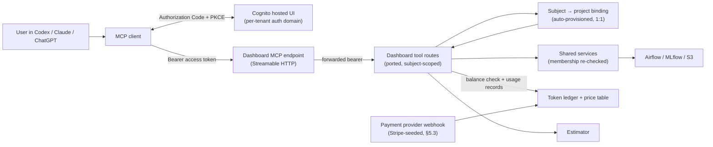

# Helical Platform Plugin — Design Blueprint

Status: production design target with a minimal local reference scaffold
Plugin: `helical-platform`
Version: `0.1.0`
Last reviewed: 2026-07-30 (amended to resolve design-review comments)
Repository: [helicalAI/heli-plugin](https://github.com/helicalAI/heli-plugin)
Tracking: GitHub epic [helicalAI/dashboard#1756](https://github.com/helicalAI/dashboard/issues/1756) · plan in [`PLAN.md`](PLAN.md)

## 1. Purpose

This document is the single design reference for a plugin that:

- exposes an explicitly allowlisted, ported subset of the existing Helical dashboard API as MCP tools;
- serves individual ("physical person") users in a dedicated tenant, separate from the enterprise tenants;
- packages the first end-to-end workflow — **computing embeddings** — as tools plus a skill, with **fine-tuning** and **perturbation analysis** to follow in that order (§7.0);
- bills usage **per token**, with the price per token varying by model, and provides an **estimator** of tokens and price before any billable work starts;
- prevents credentials from leaking into prompts, logs, or distributable artifacts.

The central design decision is to keep five concerns separate:

1. **Plugin installation** makes tools and skills available.
2. **Authentication** establishes the user identity (Cognito, per-tenant pool).
3. **Authorization and entitlement** determine what that identity may run and whether its balance permits it.
4. **Metering and billing** record actual token consumption and convert it to charges.
5. **Per-user project isolation** maps each user to one auto-provisioned platform project (indication) that collects all of their datasets, runs, and results.

Terminology note: this product is **metered**, not "paywalled". An early draft used a generic licensed-content framing (`paywalled-research`, article search tools); that framing is retired and no longer present in the repository. The scaffold now implements the §7 tool contract directly.

## 2. Product and platform boundary

### 2.1 The platform as it exists

The plugin is a façade over three existing repositories:

- **`dashboard`** — Next.js 15 + tRPC 11 + Prisma 7 (Postgres). The domain ontology lives in `prisma/schema.prisma`: `User`, `Project` (user-visible in enterprise tenants as an "indication"), `ProjectMembership` (`EDITOR`/`VIEWER`/`GUEST`/`BETA_TESTER`), `RunMeta`, `ModelMeta`, `ArtifactMeta`, `DataScMeta`/`DataSeqRNAMeta`, and more. Airflow executes DAGs (`embedding`, `finetuning`, …); MLflow tracks fine-tuning runs only; S3 holds the actual bytes, which are never stored in the database.
  - The dashboard already exposes ~44 agent-facing routes under `src/app/api/agentcore-mcp/` built with `defineGetTool`/`definePostTool` (Zod contracts, Cognito bearer auth, OpenAPI 3.1 registry). **This surface is not an MCP server** — it is an OpenAPI spec consumed by an AWS Bedrock AgentCore Gateway that fronts a full agentic loop. It is the primary source of ported route logic, not the transport.
  - Fail-closed project scoping is the repo's central invariant: `memberProjectWhere` / `projectScope` (`src/lib/projectAccess.ts`, `src/lib/projectScope.ts`), ESLint-enforced in routers (`eslint-rules/projectScopeRule.ts`), specified in `docs/DATA_SEPARATION.md`, and re-checked independently by the `check_access` first task of every DAG in the `dags` repo.
- **`infra`** — Terraform. One `modules/tenant` instantiation per tenant: its own Cognito user pool, five RDS instances, S3 buckets, Airflow, JupyterHub, and (where enabled) the AgentCore stack. Identity findings that constrain this design are in §4.
- **`helical-mcp`** — **not used.** A Python Streamable HTTP MCP server from an earlier proof of concept, superseded by the `agentcore-mcp` pattern in the dashboard. It targets `/api/mcp/trpc/*`, deleted from the dashboard in `233f4aa8`, so every tool it exposes 404s. Nothing here builds on it and it is not being revived: **the MCP endpoint lives in the dashboard**, in the same route group as the tools it serves.
- **`dags`**, **`configs`**, **`bioagents`**, **`bioutils`** — also central to any change that reaches compute: `dags` holds the Airflow DAGs (including the `check_access` gate), `configs` the per-tenant Kubernetes manifests, `bioagents` the data-ETL service the dataset tools call, and `bioutils` the shared analysis library.

### 2.2 The individual-user tenant

Initially, individual users are served by a **new "physical person" tenant**: one more instantiation of `modules/tenant` (one deployment = one tenant remains the tenancy model). Enterprise tenants (`mt`, `eli`, `novartis`, `pfizer`, …) are unaffected.

Within this tenant:

- **One project per user, auto-provisioned.** On first authenticated request (or via a Cognito post-confirmation hook), the platform transactionally creates a `Project` with an opaque, subject-derived slug (e.g. `user-<cognito-sub>`; the slug is a security principal in S3 paths and MLflow experiment names, so it must be immutable and non-enumerable) and a single `ProjectMembership { userId, projectId, role: EDITOR }`.
- **The user owns everything inside it.** All uploaded datasets, embedding runs, artifacts, and downloads are collected in that project.
- **Provisioning also creates the user's MLflow workspace.** Workspaces are created by hand in the MLflow UI today. Self-service signup cannot depend on a manual step, so the provisioning path must also create the MLflow workspace that `workspaceForProjectSlug(slug)` resolves to, alongside the project and membership. A user whose workspace is missing cannot complete a run.
- **Cross-indication porting is disabled.** Copying runs, models, or datasets between projects (`docs/PORTING.md`, `models.copyToWorkspace`, `dataSc.importFromProject`) is already unreachable here because a user is the sole member of exactly one project — but it is gated off explicitly rather than left to follow from scoping.
- **No collaboration.** No second membership is ever created; no sharing, invitations, membership listing, or cross-user search exist in this tenant. Collaboration remains a future security model, not something to approximate now.
- **No project management in the MCP surface.** Tools derive the project from the verified subject; they never accept or return a project selector. The project is an internal tenancy adapter, and the existing enterprise admin flows (`projects.create` is `helicalAdminProcedure`) are bypassed by a dedicated internal provisioning path — not exposed as a tool.
- **Isolation invariants carry over unchanged** from `docs/DATA_SEPARATION.md`: membership predicate inside the `WHERE`, 404 on reads / 403 on writes, nonexistent and unauthorized collapse into the same response, no cross-user rows, counts, facets, or timing signals.

Cost note: `modules/tenant` has no "lite" variant — a new tenant inherits 5 RDS instances, Redis, EFS, JupyterHub, and Airflow (28 required variables, 17 of them secrets). Right-sizing the individual tenant is an infra work item, not a blocker.

Trim scope (settled in review): the consumer tenant needs only the dashboard, Airflow, and MLflow. JupyterHub and the Coder/VSCode surface are dropped, and Redis is an Airflow dependency that can go with them. That lands well below the enterprise tenant's five RDS instances; the exact trimmed module variant stays an infra work item. Note this trim assumes Variant A — if compute moves to a managed serverless platform (§5.5), Airflow leaves too and the tenant shrinks further, possibly to no Kubernetes at all.

Compute locality is unresolved (§14), and it is not a purely operational question — three of its consequences reach billing correctness, so it is treated as its own decision in §5.4.

### 2.3 Porting rules for the MCP façade

The MCP surface **replicates the relevant `agentcore-mcp` routes into a B2C route group**. It is a port, not a second system: the replicas keep calling the dashboard's own application services and the dashboard's database. What they shed is the *UI-shaped* assumptions, because a B2C user never opens the platform UI — only the signup, top-up, and sign-in screens (§2.5). Concretely that means dropping the `conversationId` those routes use to resolve and authorize a project, and dropping the in-chat approval queue, which would otherwise queue an approval into a screen the user will never see (§6.1).

- each tool maps to an existing dashboard route or shared service (`src/trpc/routers/**` service modules, `agentcore-mcp` handlers), preserving its validation, Zod contract, and policy behavior;
- **every ported or new service re-checks membership itself.** Today, shared services take `(prisma, args)` and rely on the calling procedure/route for authorization; that caveat is retired. The subject→project resolution and the membership check move into the service, so no caller can reach data by skipping the gate;
- `conversationId`-based scoping (used by the chat-bound `agentcore-mcp` routes such as `triggerEmbedding` and `listModels`) is replaced by **subject-derived project resolution** — the MCP caller has no dashboard conversation;
- **the approval queue is replaced by direct execution** (§6.1), which is what makes the `triggerValidated` helper — present in `agentcore-mcp/airflow/trigger/_helpers.ts` today with zero callsites — finally the one that gets used;
- **project scope leaves the URL entirely** (§2.3.1);
- the routes that `agentcore-mcp` simply lacks are added rather than replicated: the cost estimate, the balance read, dataset upload and registration, and artifact download (§8.2 lists the full gap);
- generic passthrough, raw queries, project CRUD, and collaboration primitives are omitted;
- platform failures are normalized into the public error contract (§6) without leaking internal identifiers;
- the `projectScopeRule` ESLint rule is extended to cover the new route group, so a missing scope predicate fails CI there exactly as it does in the tRPC routers. It has repeatedly caught what it was designed for, and the new surface is precisely where an unscoped query would be most costly;
- the group publishes its own OpenAPI 3.1 spec plus a browsable Swagger UI (mirroring the bio-agent service's `/docs`), so what is exposed is auditable at a glance rather than inferred from the filesystem.

Mechanically this is the same authoring pattern as the current in-dashboard agent routes — `defineGetTool`/`definePostTool` with Zod contracts and bearer auth — with one change: the OpenAPI registry is injected instead of imported as a singleton, so the new routes register into their own spec. The enterprise AgentCore spec is untouched and never gains these tools.

Adding a capability to the MCP surface requires an allowlist and security review; the dashboard supporting it is not sufficient.

#### 2.3.1 How project scope travels

Today `agentcore-mcp` carries scope in the URL: `conversationId` as a path segment on the triggers and a query parameter on `listModels`, `projectId` as a required query parameter on `listDagRuns`. **The port carries it nowhere.**

There is exactly one rule: **scope is derived from the verified subject, and never transmitted.** No path segment, no query parameter, no header, no body field. One project per user (§2.2) means there is nothing to select, so the resolver takes the authenticated subject and returns its project — and since the answer is a pure function of the token, sending it would only create the possibility of disagreeing with it.

That is the point. A transmitted identifier is an input to be validated; a derived one is not an input at all. The class of bug where a caller names someone else's project — and the class of check that has to catch it — simply does not exist. The model's only influence is over *which dataset or run* it names, and those are authorized against the derived project separately.

Consequences to accept deliberately:

- **A multi-project user cannot be served by this surface.** That is consistent with §2.2 and §2.5, and if it is ever needed it is a new design decision with its own security review — not a header bolted onto this one. Reintroducing a transmitted scope would reintroduce the validation burden it was removed to avoid.
- **There is no approval-queue concept.** `getConfirmationStatus` exists on `agentcore-mcp` only because the queue is conversation-bound; with direct execution (§6.1) there is nothing to poll, and the tool is not ported.
- **Four of today's routes cannot be called without scope** — `listModels`, both triggers, and `getConfirmationStatus` — so those tools are unusable against `agentcore-mcp` until the port lands. Routes that already scope from the resource or the caller's memberships (`data`, `run-details`, `files`, `s3`, `umaps`) work in both worlds.

Implementation note for the port: because scope stops being a Zod-validated path or query field, it can no longer be plumbed per route. It belongs in the shared resolve step alongside `authenticateUser` — the same place `requireSubjectProject` lives — which is also what stops a new route from forgetting it.

### 2.4 Reevaluated: extend the platform vs. build a lean service around the DAGs

The alternative considered is: skip the second full platform instance, and write a small B2C service — its own API, its own scheduler, its own minimal database — that reuses only the Airflow DAGs. It is worth taking seriously, because roughly 85–90% of the dashboard's ~95k hand-written lines is irrelevant to embeddings (ISP/investigations, benchmarks, chat, reports, model-factory, JupyterHub, admin, porting, backfills), only 4–7 of its 27 Prisma models are needed, and the whole flow is on the order of 1,000–1,400 new lines.

**What the coupling actually is.** The DAGs talk to Postgres directly, in raw SQL with the dashboard's table names, column lists, and Postgres enum casts (`::dag_id_enum`, `::terminal_state_enum`, `::artifact_type_enum`); there is no abstraction layer and no schema definition in the `dags` repo. But the two directions behave very differently, and this is the decisive detail:

- **Reads are fail-closed.** `assert_project_access` (`dags/db/access.py`) has no exception handling by design: a missing table, an unreachable database, or zero matching rows raises and the DAG refuses to run. It needs exactly `user(id, cognito_sub, deleted_at)` and `project_membership(user_id, project_id, role)` — four columns across two tables.
- **Writes are best-effort.** `finalize_run` (`dags/db/runs.py:185-261`) wraps every `run_meta` and `artifact_meta` write in `try: … except Exception as e: print(WARNING)`. If those tables do not exist, the DAG logs a warning and **succeeds**.

So a lean service's mandatory coupling is two read-only tables, not the whole schema: it can skip `run_meta`/`artifact_meta` entirely, poll Airflow for status, and discover results by listing the run's output directory. Option B is genuinely feasible and smaller than it first appears.

**Why the recommendation is nonetheless to extend the platform.** Four reasons, in order of weight:

1. **Option B does not shed the expensive infrastructure — it keeps precisely the expensive parts.** "Reuse the Airflow DAGs" means still running Airflow 3.0.2, the DAG git-sync, the tenant Kubernetes namespace, the S3-mountpoint PVC at `/projects`, the GPU nodepools with their ten tolerations, and the bio-agent CUDA image. The lean service's "scheduler" is not a replacement for Airflow; it is an additional layer in front of it. What option B actually drops is the dashboard (code that already exists and works), MLflow, and JupyterHub/Coder/Redis — and the last group is already dropped by the trim decision in §2.2. The real comparison is therefore not 95k lines against 1.4k; it is *reuse a working BFF* against *write and operate a second one*.
2. **The roadmap pulls option B back toward the shared schema exactly where it hurts.** Fine-tuning is stage 2 (§7.0), and it *requires* MLflow, registering its output by inserting `mlflow_run_link` and `model_meta` rows keyed on the MLflow run id. A service that skipped the write-side schema would have to adopt it, or fork `dags/db/finetuning.py`, at precisely the moment the product gets more valuable. (An earlier draft also cited fine-tuning's eleven tasks and per-run PVC lifecycle as orchestration worth keeping Airflow for. That was wrong: `branch_pvc` returns `create_pvc` only when the run is Nebius and `skip_pvc` otherwise, so on AWS those branches are no-ops and fine-tuning has the same thin shape as embedding. MLflow registration, not orchestration, is the real tie — see §5.5.)
3. **The trigger contract is documented only in the dashboard's TypeScript.** Nothing in the `dags` repo specifies `conf`. The required field set lives in `virtual-lab/schemas.ts` and `dag-schemas.ts` plus bio-agent's pydantic model, with non-obvious landmines (omitting `modalities` fails at runtime for TranscriptFormer models; `config.output_dir` must be stamped by the caller as `/projects/<slug>/data/airflow/embedding`, and the DAG appends the run id itself). A second implementation re-derives that from two other repos and then drifts from it silently, because no type system spans the repo boundary.
4. **Operational surface.** A second deployable means a second CI/CD path, a second on-call story, a second set of migrations, and a second place where the isolation invariants must hold — against a platform that already has the fail-closed scoping rule, the ESLint guard, the reconcile loop, and 84 test files.

Two further notes. The token-billing decision (§5.1) removes one of option B's cited advantages: because price no longer derives from the empirical `BASE_DURATIONS` seconds-per-row table, copying that table is no longer a billing-divergence risk — only the "how long will I wait" estimate would drift. And the base-model catalogue is *already* a static TypeScript config (`src/lib/models/classify.ts`, 13 families / 34 variants) rather than a database table, so a B2C product offering only foundation models needs none of the model-registry code or MLflow in stage 1 under either option.

**This conclusion is conditional on staying with our own Kubernetes for compute.** If the GPU decision in §5.4 goes to a managed serverless platform, the first argument above inverts — there is no Airflow, no tenant Kubernetes namespace, no fuse mount to "keep" — and this decision must be re-taken. §5.5 sets out exactly what moves. That is why the compute decision is a gate placed before the infrastructure work, not a later step.

**Decision (under Variant A): extend the platform as a trimmed individual-user tenant (§2.2), and draw the seam so that splitting out later is a refactor rather than a rewrite.** Concretely, three things make that true and are worth doing regardless:

- **Extract a shared DAG-contract package** from the dashboard — `constants/paths.ts` (drop its one type-only import), `lib/models/classify.ts` verbatim, the DAG-contract half of `airflow-constants.ts` (split from its `lucide-react` icon map), and `embeddingsApiPayloadSchema` (relocate out of `src/app/agents/`). All four are plain TypeScript today; roughly 450 lines. This converts the top divergence risks into a versioned dependency and is the prerequisite that makes any future split cheap.
- **Keep the B2C surface in its own route group** (§2.3) with its own OpenAPI spec, so it is liftable as a unit.
- **Do not take new dependencies** from the B2C path on the subsystems a split would leave behind (investigations, chat, benchmarks, confirmations).

**What would flip this decision**, and should be revisited if any becomes true: the consumer product needs a separate compute fleet, region, or cloud account (already open in §14 — this is the most likely trigger); the roadmap stops at embeddings, with no fine-tuning and therefore no MLflow or branchy orchestration; the consumer storage layout diverges from `/projects/<slug>/`, which is structural in three repos; or consumer traffic makes the shared tenant's blast radius unacceptable.

### 2.5 Parametrising what each edition exposes

The two products draw almost disjoint surfaces from one codebase. The B2C tenant needs authentication, self-service sign-up, and checkout — and, separately, the MCP tool surface. The B2B tenants need the full platform *except* sign-up and checkout, with a different auth flow. Deployment is one tenant per instance, so the variation is per-deployment, not per-request or per-user.

**Starting point: there is no mechanism to extend.** No feature-flag system exists (no library, no table, no partial attempt), and there is no typed environment validation — `src/env.ts` is a six-line file of hard-coded docs credentials, not an env module. What exists today is eight ad-hoc `NEXT_PUBLIC_NAMESPACE` comparisons scattered across seven files, including the same tenant list `["dev","local-dev","pfizer","novartis","mt"]` duplicated between client (`PlatformContext.tsx:154`) and server (`airflow-services.ts:185`) with no shared constant — a divergence bug waiting to happen. Two idioms are already in conflict: exact-match `.includes(ns)` against an array, and substring `ns.includes("dev")`, which would also match a tenant named `devon`.

Three things are worth inheriting rather than replacing. `next-runtime-env` injects `NEXT_PUBLIC_*` at container start, so one image already serves every tenant with per-deployment configuration. `helical_admin` is a working precedent for redundant enforcement at three layers (tRPC procedure, component, page). And `ProjectRole.BETA_TESTER` exists with a schema comment describing exactly the per-user gating hook this design deliberately does *not* need yet — it has one reference in the entire repo, in a role-ordering table, and gates nothing.

#### The model: a named edition, as data, keyed by the namespace

A single `src/config/tenants.ts` maps each deployment namespace to a typed capability manifest, with the edition supplying defaults and per-tenant entries overriding them:

- **`edition: "b2b" | "b2c"`** determines the broad shape (sign-up, checkout, platform UI, which API surfaces mount).
- **Per-tenant overrides** stay explicit, because real variation already exists *within* B2B: attention analysis is on for `dev`/`pfizer`/`novartis`/`mt` but not `eli`/`internal`; the idle-timeout logout is `novartis`/`dev` only; the OpenTargets report picker is dev-only.

No new environment variable is needed — `NEXT_PUBLIC_NAMESPACE` already identifies the deployment, and deriving the manifest from it removes any possibility of edition/namespace skew. An unknown namespace must **fail at boot**, not default quietly; that boot-time validation is the piece the codebase currently lacks entirely.

Why a named edition rather than a bag of independent booleans: N independent flags describe 2^N configurations, of which exactly two are ever built, shipped, or tested. The edition is a product definition with an indefinite lifetime, not an experiment awaiting cleanup, so it belongs in reviewed, versioned data next to the code it governs.

Why not a managed flag service (LaunchDarkly, PostHog, Unleash): every argument for one is absent here. There is no per-user targeting, no gradual rollout, no non-engineer changing values, and no need to flip anything without a deploy — a tenant is already created by Terraform with 23 required secrets and an ArgoCD application, so adding one is inherently a reviewed multi-repo change. A flag service would add a runtime dependency on the request path whose failure mode is *serving the wrong product*, in exchange for agility this axis does not need.

#### Enforcement: three layers, one manifest, in trust order

1. **The API is the security boundary, and it must deny by default.** Two complementary mechanisms:
   - **A root-level path allowlist.** One middleware at the base of the procedure ladder compares the called procedure's `path` against the edition's allowed router prefixes and returns `NOT_FOUND` for anything else. This is deny-by-default: a router added tomorrow is unreachable in an edition until it is explicitly claimed, so the failure mode of forgetting a gate is "inaccessible", not "exposed".
   - **`featureProcedure(capability)`** beside `helicalAdminProcedure` in `src/trpc/init.ts` for finer, capability-level gates within an allowed router. The existing three-line admin gate proves the pattern fits.

   **Do not prune the root router object itself**, even though pruning is the instinctive way to make a disabled procedure "not exist". `AppRouter` in `_app.ts` is the type the client is generated from, so omitting a router by configuration makes the client's *types* depend on server environment — a disabled capability becomes a compile error in shared code rather than a runtime `NOT_FOUND`. The root allowlist gives the same reachability property (the procedure cannot be invoked) without coupling types to deployment. This distinction matters: OWASP's Broken Function Level Authorization guidance is about endpoints being *reachable* when they should not be, and is explicit that a URL path is not evidence of who may call it — a runtime allowlist satisfies it; a UI that merely hides the link does not.
2. **Page routes are gated in middleware.** `src/middleware.ts` matches `/api/:path*` only today, yet already contains a dead page-vs-API branch (redirect for pages, `401` JSON for API) from before the matcher was narrowed. Widening the matcher and adding a manifest-driven prefix check gives true server-side 404s with no client-side flash — unlike the current `useEffect` → `router.replace("/")` idiom in `dev/style-guide/page.tsx`, which renders the page first. Two caveats: check the capability prefix *before* the auth call so page navigation does not pay for a session lookup it will discard, and use `process.env` rather than `next-runtime-env`'s `env()`, which does not work in the Edge runtime.
3. **Navigation is cosmetic.** `Sidebar.tsx` is hand-written JSX with no array to filter, so hiding items per edition requires refactoring it into a data-driven `NAV_ITEMS: {href, icon, label, capability?}[]`. That refactor is contained and worth doing, but the nav must never be the only gate — hiding a link while leaving the endpoint reachable is the classic UI-gated-but-API-open failure.

The MCP surface is deliberately **structural rather than flag-gated**: it is its own route group with its own OpenAPI registry (§2.3), so the published spec *is* the allowlist and a capability that was never registered cannot be reached by any configuration.

For the new B2C screens, add a `src/app/(b2c)/` route group rather than restructuring the eleven existing top-level page directories. The repo has no route groups today, so this establishes the convention cheaply and gives the two editions genuinely different shells without touching B2B pages.

#### Closing the app/infrastructure skew

This is the sharpest existing risk, and it is live today. The app renders Amplify's sign-up tab unconditionally — there is no `hideSignUp` anywhere in the repo — so whether self-registration actually works is decided entirely by Cognito's `admin_create_user_config`, set in Terraform. The application and the identity provider can therefore disagree silently, and §4.1's new `allow_self_signup` variable makes that worse if the app is not gated in step. Three mitigations:

- pass `hideSignUp={!features.selfServeSignup}` in `authenticator.tsx` so the code states the intent rather than relying on the pool;
- treat the Terraform variable and the manifest entry as one decision recorded in two places, and **reconcile continuously rather than once** — expose the resolved edition and sign-up capability from `/api/health-check` and have a periodic check compare them against the pool's actual `admin_create_user_config`. Microsoft's multitenant identity guidance is emphatic on this point: app-versus-identity-provider configuration drift is a recurring operational failure, not a one-time setup concern, and their own tooling rescans on a schedule rather than trusting deploy-time agreement;
- note the related landmine: `addUserToDefaultProject` grants every new login **EDITOR on the hard-coded `pilot` project** if one exists. On any tenant where self-signup and a `pilot` project coexist, that is a real privilege issue. §2.2 replaces this path for B2C; B2B tenants should confirm `pilot` is absent in production.

#### Management: types, tests, and review — not a console

Because the manifest is plain data, "managing the flags" reduces to three cheap checks in CI:

- **Completeness** — every capability referenced by a gated procedure, page prefix, or nav item resolves to a key in the manifest type. The type system does most of this for free.
- **No unclassified surface** — every top-level page directory and every tRPC router is claimed by at least one edition. This is the test that stops a new B2B feature from silently appearing in B2C.
- **Per-edition snapshots** — enumerate the exposed procedure names and page prefixes for each edition and snapshot them. Any change to what an edition exposes then shows up as a reviewable diff rather than a surprise in production.

Two editions is what makes this affordable. The accepted practice for toggle testing is to cover the configurations that actually reach production plus the fallback state, because the cross-product of independent flags is not testable in principle — ten independent booleans already describe over a thousand states. Collapsing the variation into two named editions turns "untestable in principle" into "two suites".

The second axis — per-user rollout, beta access, incident kill switches — is a genuinely different concern with a different lifetime, and should stay separate from edition configuration. `BETA_TESTER` is the pre-authorised hook for it; implement it when a real need appears, and do not conflate the two.

#### Where this sits in established practice

Fowler and Hodgson's toggle taxonomy has four categories — release, experiment, ops, and permissioning — and this variation is none of them: it is product configuration resolved once per deployment. Their guidance for exactly that case is to prefer static, source-controlled configuration aligned with the deployment pipeline over dynamic runtime toggling, and to keep the decision point out of scattered conditionals. Meinicke et al. (ICSE-SEIP 2020) make the same separation from the research side: feature flags and configuration options are technically similar but differ in intent and lifecycle — flags are short-lived and developer-owned, configuration is long-lived and deployment-owned — and tooling built for one is routinely misapplied to the other. That is the reason edition configuration and the per-user `BETA_TESTER` axis stay separate here.

Uber's Piranha work quantifies the cost of getting this wrong: they built AST-level tooling to remove stale flags, generating cleanup diffs for 1,381 of them and eventually retiring roughly 2,000, because long-lived flags without ownership become permanent untested branches. Since an edition is *intentionally* long-lived, the discipline that keeps it from becoming that debt is having very few of them and expressing them as data. Finally, one deployment per tenant is itself an established pattern — Azure's Deployment Stamps — whose stated advantage is that per-tenant isolation needs no multitenancy logic in the application layer, which is precisely why the edition can be a provisioning-time fact rather than a request-time decision.

References: [Feature Toggles — Fowler & Hodgson](https://martinfowler.com/articles/feature-toggles.html) · [Feature Flags vs Configuration Options — Meinicke et al., ICSE-SEIP 2020](https://www.cs.cmu.edu/~ckaestne/pdf/icseseip20.pdf) · [API5:2023 Broken Function Level Authorization — OWASP](https://owasp.org/API-Security/editions/2023/en/0xa5-broken-function-level-authorization/) · [Piranha — Uber](https://eng.uber.com/piranha/) · [Deployment Stamps — Azure Architecture Center](https://learn.microsoft.com/en-us/azure/architecture/patterns/deployment-stamp) · [Identity in a Multitenant Solution — Azure Architecture Center](https://learn.microsoft.com/en-us/azure/architecture/guide/multitenant/considerations/identity)

Two parts of this design have no directly published prior art and are reasoned extensions of adjacent practice rather than citable patterns: keeping a published OpenAPI spec in sync with the enabled edition (the nearest established practice is generating the spec from the live router rather than maintaining it by hand, which is what §2.3 does), and the "every route must be claimed by an edition" completeness test (the nearest analogue is type-system exhaustiveness checking over a closed set).

#### First step

Before adding anything, absorb the eight existing namespace checks into the manifest. That single refactor removes the duplicated client/server tenant array, replaces substring matching with typed lookup, and gives the new editions somewhere to be declared — it is a prerequisite that pays for itself independently of this product.

## 3. Production architecture



- The MCP server stays sessionless and credential-free; the dashboard verifies every forwarded token and is the sole authorization authority.
- The token ledger is written server-side from authoritative run outputs — never from client-supplied counts.
- Checkout/top-up happens on the merchant domain; the payment processor is still an open decision, seeded with Stripe (§5.3).

## 4. Identity, signup, and account linking

Grounded in the `infra` repo (`modules/tenant/`): each tenant has its own Cognito user pool, hosted UI domain (`<sub>.platform.helical-ai.bio`, ACM cert in us-east-1), and app clients. Authorization Code + PKCE is viable today on the public-client pattern (`main` client: `allowed_oauth_flows = ["code"]`, no secret). There is **no OAuth issuer other than Cognito**, and none is needed.

### 4.1 Required infra changes for the individual tenant

1. **Enable self-signup with a new variable.** `user_pool.tf:88-90` sets `allow_admin_create_user_only = true` unless `enable_sso` is on. Do not reuse `enable_sso` (it drags in the OIDC IdP and relaxes required attributes); add an explicit `allow_self_signup` flag. Email verification via the existing SES identity; password policy (14 chars, symbols) stays.
2. **Add a dedicated public MCP app client**: `allowed_oauth_flows = ["code"]`, no secret, PKCE, pinned redirect URIs. Cognito has no wildcard ports, so local MCP clients need a fixed loopback callback (e.g. `http://127.0.0.1:41234/callback`) plus the hosted client callback(s). Refresh token validity 30 days (matching the `agentcore` client), not the 5-day default of `main`.
3. **Grant a custom resource-server scope.** The AgentCore gateway (and, by convention, any JWT-gated surface here) rejects tokens carrying only standard OIDC scopes; the MCP client must request a custom scope (reuse `agentcore/invoke` or add a `platform-mcp/invoke` scope to a resource server) and the client must list it in `allowed_oauth_scopes`.
4. **Custom-domain cap**: only 4 Cognito custom domains per region; the new tenant may need the `*.auth.<region>.amazoncognito.com` fallback (`disable_cognito_domain = true`). Functionally fine for PKCE; cosmetically worse for a consumer sign-in page.
5. **One consumer pool, all channels.** A single Cognito user pool serves every individual user regardless of which client they arrive from — Codex, Claude, or a future one. The channel is not an identity boundary. Per-tenant pools remain the enterprise model.
6. **Social identity providers (optional).** Google, Microsoft, and Apple sign-in are inexpensive to add on the pool side (`supported_identity_providers` plus one `aws_cognito_identity_provider` per IdP) and cut consumer signup friction materially. Shipping them at launch is an open decision (§14), but the pool cannot be replaced later to accommodate them: Cognito attribute schemas are immutable, so `given_name`/`family_name`/`phone_number` must already be relaxed to optional when the pool is created.

### 4.2 Required dashboard change

`src/lib/cognito-bearer-auth.ts:37` currently verifies bearer tokens with `clientId: null` — accepting tokens minted by **any** client in the pool, with a TODO to tighten. Before the MCP surface ships, replace this with an explicit client-ID allowlist (the MCP client, `main`, `api`) and enforce the required scope.

To be precise about what this does and does not expose: a token from an unrelated Cognito pool, or a hand-forged JWT, is already rejected — verification pins the issuer and validates the signature against that pool's JWKS, so neither a made-up token nor a pool someone stands up themselves gets in. The gap is narrower and internal: any app client *within our own pool* is currently accepted, so a token obtained through the `api` client's password flow reaches routes meant for another client. The allowlist plus a required custom scope closes exactly that.

Also required for this tenant: gate off the Jupyter/Coder surface, and gate off the cross-indication porting flows (`docs/PORTING.md`).

### 4.3 Protocol plumbing

- Cognito publishes OIDC discovery at the issuer, but nothing serves RFC 9728 protected-resource metadata. **The dashboard must serve `/.well-known/oauth-protected-resource`** pointing at the tenant issuer so spec-compliant MCP clients can discover the authorization server, and return the MCP OAuth challenge (`401` + `WWW-Authenticate`) on unauthenticated calls. A further constraint: Cognito does not support Dynamic Client Registration (RFC 7591), which the MCP OAuth flow otherwise expects, so clients must accept a **pre-registered `client_id`** shipped in the plugin's configuration. Confirm the target clients do before relying on discovery alone.
- Cognito does not implement Dynamic Client Registration; the plugin ships a **pre-registered `client_id` per tenant**. Because pools (and therefore issuers and client IDs) are per-tenant, the plugin configuration must carry the tenant's issuer + client ID rather than hardcoding one authorization server.
- Token verification on every request: signature, issuer, audience/client allowlist, expiry, required scope — then subject → project resolution.

### 4.4 The linking flow

1. The user invokes a protected tool; the dashboard's MCP endpoint returns the OAuth challenge.
2. The MCP client opens the Cognito hosted UI; the user signs in **or self-registers** (individual tenant only), verifying their email.
3. Authorization Code + PKCE completes; the client holds a bearer access token (8 h) and refresh token (30 d).
4. The MCP server forwards the bearer to the dashboard, which verifies it, resolves or transactionally creates the user's project, and serves the call.
5. No relinking is needed when balances or prices change — entitlement is checked server-side per call, never encoded in the token.

## 5. Metering, billing, and entitlements

### 5.1 Model

- **Unit of charge: the token**, computed deterministically from the input's shape and the model's data preparation: `tokens = rows × input_width × model_coefficient` for embeddings, with one additional factor for the later operations (× epochs for fine-tuning, × genes perturbed for perturbation analysis). Nothing in the count depends on how the run actually executes — which is what lets the quote and the invoice be the same number.
- **Why tokens rather than GPU-hours.** The platform's real variable cost is GPU time, so the objection that "our tools don't spend tokens, they consume GPU hours" is fair. Tokens are nonetheless the billing unit because: the cost of a run is trivial to compute and show before the user commits; it lets us steer users toward the models that are cheapest for us to serve; there is no exposure when GPU capacity is scarce and a run queues or is retried; and month-over-month token volume is a cleaner adoption signal than spend. The trade-off accepted in exchange is less predictable revenue per user and storage/fixed costs that token revenue does not track. To keep this honest, **the per-model coefficients are derived from measured GPU-hours** (equivalently, from enterprise-rate hours) so no model presents an arbitrage opportunity against its true cost.
- **Price varies by model.** A server-side price table keys `price_per_million_tokens` by `(model, version)`. Model listings include the current price so agents can compare before choosing.
- **Metering is server-authoritative, and the debit happens at launch — not at completion.** Because the token count is fully determined before the run starts, the platform debits the ledger inside the same transaction that dispatches the DAG, keyed idempotently by `run_id`. Client-supplied counts are never billed. The existing usage plumbing (GPU-hour rollups in `admin/usage.ts`, the `ActorType` label propagated into DAG metadata) is the reporting foundation; the token ledger itself is new.
- **Concurrency cannot overdraw the balance.** Charging at completion would permit exactly this: top up €1, fire ten runs worth €100 each before any of them finishes, and collect €1000 of compute for €1. Debit-before-dispatch closes it — the balance is read under a row lock and decremented in the launch transaction, so the run that would take the balance below zero is refused no matter how the requests interleave. The per-user concurrent-run cap limits queue flooding on top of that.
- **Failed and cancelled runs are not charged.** The launch debit is a reservation; when a run reaches a terminal `failed` or `cancelled` state the platform writes an idempotent refund entry against the same run. Because the dags repository writes terminal state straight to Postgres and no completion callback exists, settlement runs lazily on the read paths that observe terminal state, plus a sweep job — both idempotent, so a DAG retry can neither double-charge nor double-refund. Note this policy is what makes the compute-sourcing decision financial rather than operational: every infrastructure-caused failure is a refund we fund, which is why the spot-instance default in §5.4 has to be a conscious choice.
- **Entitlement = balance check.** Every billable call checks the subject's balance server-side. The commercial shape is **prepaid credits** (decided): fails closed, no surprise bills, and decouples this design from the payment-processor choice.
- **Free monthly credit (optional, design for it now).** The ledger must support a second credit class: a **monthly grant of a few thousand tokens**, consumed before paid credits, expiring (not accumulating) at the end of each period, and granted per verified account. Whether and at what size to enable it is a launch parameter, but grant class, consumption ordering, and expiry belong in the ledger schema from day one so enabling it is a config change, not a migration. Free-grant consumption produces the same auditable ledger entries as paid usage.

### 5.2 The estimator

A first-class facility, exposed as **one endpoint and one tool per operation** — `estimate_embedding_run`, `estimate_finetuning_run`, and one per operation added later (§7.0) — and echoed in job kickoff.

One shared estimator would be the wrong shape. The token count is a different function of different inputs in each case (rows × width × coefficient for embedding, × epochs for fine-tuning, × genes perturbed for perturbation), so a single endpoint would need either a discriminated-union body — which the gateway rejects, and which is exactly why the trigger routes are already split per DAG — or a lowest-common-denominator body that cannot express any operation properly. Splitting also keeps the rule enforceable: **an operation ships with its estimator or it does not ship**, because an operation that can be started but not priced breaches estimate-before-spend (§6.1).

Common to all of them:

- Input: the same parameters as the run it prices, so the quote is tied to what will actually execute — `dataset_id` and `model` everywhere, plus `labels` and `epochs` for fine-tuning. Changing any of them invalidates the quote and needs a fresh one; a quote is not a general price list.
- Output: `estimated_tokens`, `price_per_million_tokens`, `estimated_price`, `assumptions` (rows/genes counted, subsampling, tokenizer version), and a `quote_id` with a validity window.
- Estimates derive from dataset metadata the platform already has (row count, gene count, obs columns) plus the model's tokenizer parameters — no billable compute.
- Because the token count is deterministic, **the quote is the invoice**: the tokens and price shown are what gets debited, and the quoted price-per-token is honored for any run started inside the quote window, so a price-table change never silently reprices a run the user already approved. A user is never shown "we estimate $80" and then billed $160.
- This deliberately replaces cost estimation built on the existing runtime estimator (`airflow/utils/time-estimation.ts`), which predicts seconds from a hard-coded per-model seconds-per-row table. That table is coupled to the current package set — switching Geneformer to flash-attention 2 invalidated it — so it is unfit as a billing basis, and keeping it accurate would be a permanent tax. The runtime estimator stays useful for telling a user how long to expect to wait; it simply no longer determines what they pay.

### 5.3 Billing events

Checkout/top-up stays on the merchant domain. The processor decision is **left open but seeded with Stripe**: design against Stripe Checkout sessions and signed webhooks (`checkout.session.completed` crediting the ledger), and keep the integration behind a thin provider interface (create-top-up-session, verify-webhook, refund) so the seed can be swapped without touching the ledger or tools.

1. A billable call with insufficient balance returns `insufficient_balance` with a short-lived, subject-bound top-up URL (no credentials embedded).
2. The provider's verified, idempotent webhook credits the ledger (paid credit class).
3. The user retries; no relinking or reinstall.

Who owns which screen: the top-up page is **ours** — a minimal Helical-owned page on our domain that creates the session and shows what is being purchased — while the payment provider's hosted checkout collects the card details. We never render a payment form ourselves, and the MCP surface never does more than hand the user a short-lived URL.

### 5.4 Compute sourcing and its billing consequences

Where the GPU work runs is normally an operations question. Here it is a design question, because three of its consequences reach billing correctness, and because per-token pricing means **we absorb all compute-cost variance** — the user's price is fixed by the model and the dataset shape, so every difference in how the run is executed lands on our margin.

**What exists today.** The DAG already forks on provider: `DynamicK8sPodOperator.execute` branches on whether `node_type` contains `nebius`. The AWS path runs `in_cluster=True` in `$TENANT_AIRFLOW_NAMESPACE` with the bio-agent CUDA image from ECR and the `/projects` S3-mountpoint PVC. The Nebius path runs `in_cluster=False` through the `nebius_k8s` Airflow connection, in a hard-coded `airflow` namespace, with a Nebius-registry image, and rewrites `config.data`/`output_dir` into `s3://$TENANT_S3_BUCKET/...` using Nebius S3 credentials and endpoint. Both are live; the choice is per-run, driven by the requested node type.

**Three consequences that are not operational details:**

1. **A new tenant gets spot instances by default.** Spot-versus-on-demand is selected by *tenant namespace name*: `novartis`, `mt`, and `pfizer` get on-demand, everything else gets spot. A new individual tenant therefore lands on spot, and the embedding DAG has **no retries configured**. A spot interruption becomes a failed run, which under §5.1 triggers a refund — so we pay for the GPU time and collect nothing. This must be decided explicitly before launch: either add the consumer namespace to the on-demand list, or accept spot and add a retry policy so an interruption costs a restart rather than a refund. (Note the two lists have already drifted — the embedding DAG's omits `dev` while fine-tuning's includes it.)
2. **Image skew can move the billing unit.** The AWS and Nebius paths pin *different* bio-agent image tags. Since the per-row token coefficient is the billing unit and is a property of the model's data preparation and tokenizer, a coefficient measured on one image is not automatically valid on another. Coefficients must be measured against a pinned image, and re-verified whenever the provider or tag changes.
3. **Artifact paths differ by provider.** The Nebius return path rewrites the produced object back to a `/datasets/`-prefixed path while the AWS path uses the `/projects/`-rooted `output_dir`. `download_result` and artifact indexing must either handle both prefixes or the design must pin one provider per tenant.

**Node type is a server-side policy decision, not a tool parameter.** The `agentcore-mcp` trigger route exposes `node_type` and `num_devices` as caller-supplied fields. The ported `start_embedding_run` (§7.1) must **not** — with per-token pricing, a caller choosing four A100s instead of one L4 multiplies our cost while paying exactly the same. The tool takes the model and the dataset; the platform picks the compute profile that the model's coefficient was priced against.

**Higher-level alternatives.** Beyond AWS and Nebius — both raw Kubernetes with our own image and storage plumbing — three managed platforms were considered. The governing criterion is narrow and worth stating plainly, because it eliminates most of the category: this workload is **our own CUDA container running one CLI over multi-gigabyte `.h5ad` files in our own storage**. It is not request/response inference against a hosted model. A platform only qualifies if it will run an arbitrary container of ours.

- **Modal** — the strongest fit, and easier than first assumed. It runs an arbitrary image pulled straight from our ECR (`Image.from_registry`), with no requirement that the container expose an HTTP endpoint, so `python3 /usr/local/bin/embedding_script.py '<json>'` transfers essentially unchanged. Crucially, **`CloudBucketMount` is built on AWS S3 Mountpoint — the same technology as our existing EKS fuse mount** — so the storage migration is close to a no-op rather than a rewrite, which is the opposite of what an earlier draft of this section assumed. Batch semantics are first-class: `.spawn()` returns a handle to poll by ID, and there is native cron and configurable retries. Per-second billing with scale-to-zero. Caveats that matter here: a **24-hour hard function timeout** (fine for runs of minutes to hours, but a ceiling); **all GPU functions are preemptible and `nonpreemptible` is not offered for GPU at all** — Modal sends SIGINT and auto-restarts on the same input, which is *better* than our current zero-retry DAG but requires idempotent, checkpoint-aware code; region pinning costs a 1.5–1.75× multiplier; STS credentials on a bucket mount **do not auto-renew**, which bites multi-hour runs using short-lived scoped credentials; and Modal's own troubleshooting guide documents **flaky NVIDIA driver initialisation on L4** requiring retry logic — directly relevant, since L4 is one of our two target GPUs and a failed run is a refund. SOC 2 Type II; HIPAA under BAA on Enterprise but with Volumes v1, Images and Memory Snapshots excluded; no VPC peering found in public docs.
- **Baseten** — a real option, but via **Training Jobs, not Truss.** The Truss/model-serving surface is HTTP-server-shaped (`start_command`, readiness and liveness probes) and the wrong tool; Training Jobs are framework-agnostic run-to-completion containers (`base_image` + `start_commands`) and fit the workload. Read-side S3 access is first-class through the Baseten Delivery Network, and — relevant given the pharma tenants elsewhere in the company — **Baseten Hybrid runs primary compute inside our own VPC with overflow to their cloud**, alongside a broader documented compliance surface (SOC 2 Type II, SOC 3, HIPAA). Against that: billing is per-minute rather than per-second and includes minutes spent deploying or scaling; there is **no documented direct-to-S3 write path for job outputs** (an in-script `boto3` upload would be needed); and neither a **maximum job duration** nor a **preemption/retry contract** is documented publicly. Those last two are exactly the guarantees a refund-liable batch product depends on, so they must be answered by Baseten before it can be chosen.
- **Runware** — **not a fit for this workload**, and the checking is worth recording so it is not re-proposed. It is a specialised generative-media inference API: roughly 400k hosted models across image, video, audio, text and vision, with bring-your-own-weights limited to diffusion artifacts (LoRAs, checkpoints, safetensors, LyCORIS). There is no support for arbitrary containers, arbitrary Python, or general batch GPU compute, so it cannot run the bio-agent CUDA image at all. Its cost claims are real but apply to media generation on its own stack — they do not transfer to running our code. It would only become relevant if Helical shipped a hosted-model inference API whose weights could live on someone else's serving stack, which is a different product from the one in this document.

These managed options break the "reuse the DAGs unchanged" premise §2.4 relied on — but only for the compute step, and only for embeddings. Fine-tuning, with eleven tasks and a per-run PVC lifecycle, is not similarly portable, which matters because it is roadmap stage 2.

**Recommendation:** launch on AWS, because it requires no new integration and matches §2.4; decide the consumer namespace's spot-versus-on-demand posture explicitly before launch, since the default silently costs money; and treat **Modal** as the designated escape hatch if consumer load contends with client capacity or if idle-capacity economics dominate. Any comparison must be made against measured GPU-hours per model rather than list prices, since that is the same measurement the token coefficients depend on.

### 5.5 What the compute decision changes — and what it does not

§5.4 presents compute sourcing as a choice within a fixed architecture. That understates it. There are really two variants of this design, and the document as written silently assumes the first:

- **Variant A — our Kubernetes.** AWS or Nebius, Airflow orchestrating, `KubernetesPodOperator` dispatching pods, the `/projects/<slug>/` S3-mountpoint PVC as the storage abstraction.
- **Variant B — managed serverless compute.** Modal (or a comparable platform), where we hand a container and a payload to someone else's scheduler and poll for completion.

The distinction matters because Variant B does not merely relocate the GPU; it removes Airflow, the fuse mount, and one of the two isolation gates from the embeddings path. Reviewing the document against that axis:

#### Invariant across both — safe to build now

Everything above the dispatch boundary is unaffected, which is most of this design:

- the **MCP tool contract** (§7) — the tools take a dataset and a model and return a run id and artifacts; nothing in the surface names a provider. This is the property that makes the decision deferrable at all;
- **deterministic token metering, pricing, quotes, the ledger, and top-up** (§5.1–5.3) — token counts are a function of dataset shape and model, not of where the run executes;
- **identity, OAuth, and account linking** (§4);
- the **per-user project** and the *intent* of its isolation (§2.2) — though the enforcement mechanism changes, see below;
- the **edition manifest and its enforcement** (§2.5);
- the **plugin artifacts and skill** (§8).

#### What changes under Variant B

1. **§2.4's conclusion has to be re-taken.** Its first and load-bearing argument was that a lean service "keeps precisely the expensive parts" — Airflow, the tenant Kubernetes namespace, the S3-mountpoint PVC, the GPU nodepools. Under Variant B none of those exist for embeddings, so that argument inverts: the lean service becomes *auth + a small database + object storage + a Modal call*, and the case for standing up a second full platform tenant weakens sharply.
2. **§2.4's second argument is weaker than stated, independent of the variant.** It claimed fine-tuning's per-run PVC lifecycle is orchestration Airflow earns its keep for. In fact the PVC branches are **Nebius-only** — `branch_pvc` returns `create_pvc` if the run is Nebius and `skip_pvc` otherwise, so on AWS they are no-ops. Fine-tuning on AWS is the same shape as embedding: a few thin wrapper tasks around one compute pod. It is therefore more portable than §2.4 asserts, and MLflow registration — not orchestration — is the real tie to the platform.
3. **Orchestration** shrinks but may not vanish. For a single-step embedding job, Modal's own cron and retry primitives can replace the Airflow trigger outright. But Modal's published guidance is explicitly *Modal for compute, Airflow retained for scheduling, dependency management and observability* — and neither Modal nor Baseten has a first-party Airflow operator today (Modal's is announced but unreleased). So the honest position is: Airflow is droppable for embeddings alone, and probably not for the fine-tuning stage. The §2.2 trim goes further under Variant B, but "no Kubernetes at all" should be treated as a hypothesis to test, not a given.
4. **Storage changes far less than expected.** An earlier draft assumed Variant B meant giving up the fuse mount for explicit object I/O. That is wrong for Modal: `CloudBucketMount` is built on AWS S3 Mountpoint, the same technology behind the existing `/projects` PVC, so the mount semantics carry over. The genuine deltas are narrower — mounted STS credentials do not auto-renew, which constrains multi-hour runs, and the path convention becomes ours to define rather than inherited from the DAG. For Baseten the picture is worse: read-side S3 is first-class but there is no documented direct-to-S3 output path, so writes become explicit in-script uploads.
5. **One gate instead of two.** §9 relies on the DAG-side `check_access` task as a second, independent gate, and the platform's convention is that writes are checked twice by mechanisms that do not trust each other. Variant B deletes it. The natural replacement is per-run credentials scoped to that user's storage prefix, so the compute physically cannot reach another user's data even if the dispatcher is wrong — but note the interaction with the previous point: short-lived scoped credentials that do not renew are awkward for multi-hour runs, so the credential lifetime and the maximum run duration have to be designed together rather than separately.
6. **Run lifecycle and artifacts.** Status comes from the platform's API rather than Airflow plus `reconcileActiveRuns`, and nothing writes `run_meta`/`artifact_meta` on our behalf, so we register artifacts ourselves. Both are *simplifications*, and they remove the `/datasets`-versus-`/projects` prefix inconsistency in §5.4.
7. **Failure and refund semantics change shape, but do not disappear.** It would be convenient if managed compute removed the spot problem. It does not: on Modal *all GPU functions are preemptible* and there is no non-preemptible GPU tier. What changes is the handling — Modal signals SIGINT and automatically restarts on the same input, which is strictly better than today's zero-retry DAG, provided the job is idempotent and checkpoint-aware. Two further first-party caveats bear directly on refund liability: Modal documents flaky NVIDIA driver initialisation on **L4** specifically, and Baseten documents no preemption or retry contract at all. Under either variant the conclusion is the same — **the run must be restartable, because the refund policy in §5.1 makes every unretried infrastructure failure a direct loss.**
8. **Data movement becomes an explicit cost line.** With a fuse mount, reading a multi-gigabyte `.h5ad` in-region is effectively free. Under Variant B, per-run transfer and model-weight cold starts are real costs that must be folded into the per-token coefficients.
9. **Data residency.** Compute leaves our AWS account. For consumer data that is a privacy-policy statement rather than a blocker, but it deserves a deliberate decision given the pharma tenants elsewhere in the company. The two platforms differ sharply here: Baseten publishes a **Hybrid** mode running primary compute in our own VPC with overflow to theirs, plus a broader certification list; Modal documents SOC 2 Type II and HIPAA under BAA, but with Volumes v1, Images and Memory Snapshots carved out of HIPAA scope, and no VPC-peering offering in public documentation. If data residency ever becomes contractual, that asymmetry outweighs the per-second-versus-per-minute billing difference.
10. Smaller consequences: the error model's "upstream unavailable" row (§6), the repository pointers (§13), and the shared DAG-contract package (§2.4) — which stays useful either way, but under Variant B becomes *our own* definition of the job payload rather than a mirror of the DAG's.

#### Questions that must be answered before Gate 0 closes

Public documentation does not settle these, and each one changes the answer:

- **Baseten**: what is the maximum Training Job duration, and what is the preemption and automatic-retry contract? Both are undocumented, and both are load-bearing for a refund-liable batch product.
- **Both**: the contractual SLA, and whether a BAA/DPA is available — public marketing pages are not evidence of either.
- **Modal**: current per-GPU rates confirmed from their own pricing page rather than third-party trackers, and whether the announced Airflow provider has shipped.
- **Ours, not theirs**: is `embedding_script.py` idempotent and restartable? Under both variants — preemptible spot on AWS, always-preemptible GPU on Modal — a run that cannot be safely restarted converts every infrastructure hiccup into a refund.
- **Ours**: measured GPU-hours per model on the candidate platform, since the token coefficients are calibrated from exactly that measurement (§5.4) and list prices are not a substitute.

#### Consequence for sequencing

This decision therefore cannot sit at step 12 of §11, after the tenant has been built. It determines whether steps 5–9 are the right work at all. **It is promoted to a gate before the infrastructure work begins.** The recommendation in §5.4 — launch on AWS — is unchanged, and choosing it deliberately and early is exactly the point; what is not acceptable is discovering at step 12 that the answer was Modal and that the tenant, the Airflow deployment, and the fuse-mount assumptions were all built for the other variant.

## 6. Protocol behavior and error model

Authentication, entitlement, and service failures stay distinct:

| Condition | Response | User action |
|---|---|---|
| No valid identity token | `401` + MCP OAuth challenge | Link or relink account |
| Missing required scope | OAuth challenge naming the scope | Reauthorize |
| Authenticated, balance too low | `insufficient_balance` + estimated shortfall + top-up URL | Top up |
| Free monthly allowance exhausted (if enabled) | `insufficient_balance` + next grant date + top-up URL | Top up or wait for reset |
| Concurrent-run cap reached | `run_limit_exceeded` + current limit | Wait for a run to finish |
| Stale estimate quote | `quote_expired` + fresh estimate | Re-confirm |
| Dataset/model/run not found **or not owned** | Identical `404`-shaped `not_found` | — (no enumeration) |
| Upstream (Airflow/MLflow/S3) unavailable | Sanitized retryable service error | Retry later |
| Project binding missing or inconsistent | Generic non-enumerable service failure | Retry or contact support |

Representative unpaid result:

```json
{
  "content": [
    { "type": "text", "text": "Estimated cost is $4.20 (13.9M tokens × $0.30/M). Your balance is $1.10." }
  ],
  "structuredContent": {
    "code": "insufficient_balance",
    "estimated_tokens": 13900000,
    "estimated_price_usd": 4.20,
    "balance_usd": 1.10,
    "top_up_url": "https://example.com/top-up/session-token"
  },
  "isError": true
}
```

Do not use an OAuth challenge as a checkout redirect; do not rely on HTTP `402` alone.

### 6.1 Confirmation policy

The dashboard's chat surface gates expensive launches through a server-side approval queue: every `trigger*` route calls `enqueueDagLaunch`, returns `{status: "pending_approval", confirmation_id}`, and nothing executes until a human approves it in the dashboard chat.

**That queue is not merely bypassed here — it is unavailable.** It resolves the project from a `conversationId`, and it renders the approval in a dashboard chat. A B2C user has no conversation and never opens the dashboard UI beyond signup, top-up, and sign-in (§2.5). An approval queued for them would render in a screen they will never look at, so the run would simply never start. Confirmation must therefore happen in the client the user is actually in — the CLI or chat app hosting the plugin:

- MCP tools execute directly; `start_embedding_run` launches the DAG without a server-side approval step;
- the **skill instructs the agent** to present the estimate (tokens, price, balance impact) and obtain the user's explicit confirmation before calling `start_embedding_run`;
- server-side mitigations bound the blast radius of a client that skips confirmation: credit is debited at launch (§5.1), so total exposure can never exceed the balance however many runs are fired concurrently; a per-user concurrent-run cap limits queue flooding; and the estimate is echoed in every kickoff response so the user sees the cost even if the agent never asked.

This is an accepted risk, revisit if the surface ever exposes destructive operations (nothing in the initial allowlist is destructive).

## 7. MCP tool contract

### 7.0 Exposure roadmap

Operations are exposed in this order, each gated behind its own allowlist and security review:

1. **Compute embeddings** — this section; the launch surface.
2. **Fine-tune a model** — port of the `finetuning` DAG trigger (`agentcore-mcp/airflow/trigger/finetuning/`) plus run/status/artifact reuse from group (c)/(d). Fine-tuned models then appear in `list_models` with their own per-token price. Requires a fine-tuning entry in the price table and estimator (training tokens ≠ inference tokens).
3. **Run a perturbation analysis** — port of the `perturbation` DAG trigger and perturbation-results routes (`agentcore-mcp/airflow/trigger/perturbation/`, `airflow/perturbation-results/`). Note the source route is the repo's reference for union-free request schemas.

Later stages reuse the group structure below (list → upload/select → estimate → run → results) and inherit all porting rules (§2.3), the estimator obligation (§5.2), and the confirmation policy (§6.1) unchanged — a new operation adds tools, never new authorization or billing semantics.

### 7.1 Embeddings surface

The first ported operation is **computing embeddings**, end to end. Four tool groups plus the estimator:

### a. Models

- **`list_models`** — port of the `listModels` service (`src/trpc/routers/models/list.ts`), promoted models by default, filterable by family (`sequence` / `single-cell`). Each entry adds `price_per_million_tokens`. Subject-scoped workspace; no `conversationId`.

### b. Datasets

- **`create_dataset_upload`** — returns a short-lived, project-scoped presigned S3 PUT URL for a new dataset file (`.h5ad` first). The MCP transport never carries file bytes.
- **`register_dataset`** — after upload, runs the existing single-cell analyze/import/QC path (`dataSc` services — the procedure bodies are inline today and need lifting into a shared service) and returns the dataset record with row/gene counts.
- **`list_datasets`** / **`get_dataset`** — port of the data catalog routes (`agentcore-mcp/data/`), including columns/obs metadata needed for estimation.

### c. Embedding runs

- **`estimate_embedding_run`** — the estimator (§5.2).
- **`start_embedding_run`** — port of `triggerEmbedding` (`agentcore-mcp/airflow/trigger/embedding/`), with four deltas: project from subject instead of `conversationId`; direct execution instead of `pending_approval` (§6.1); balance check + optional `quote_id` binding before launch; and **`node_type`/`num_devices` are removed from the input** — the platform selects the compute profile the model's coefficient was priced against (§5.4), because under per-token pricing a caller choosing more or bigger GPUs would multiply our cost at a fixed price. Returns `run_id` plus the estimate echo.
- **`list_embedding_runs`** / **`get_run_status`** — port of `listDagRuns` / run-details, including progress, task state, and (on completion) actual tokens consumed and the ledger charge.

### d. Results

- **`list_results`** / **`search_results`** — completed runs with their artifacts, filterable by model, dataset, date, and free-text label.
- **`download_result`** — short-lived presigned GET URL for a named artifact (embedding matrices, UMAPs). URLs are subject-bound and carry no reusable credentials.

Cross-cutting: **no tool takes a project, conversation, or owner identifier, and none is transmitted on the wire** — scope is derived from the verified subject and nothing else (§2.3.1). All tools are otherwise typed with the same Zod contracts as their dashboard sources; read tools declare read-only/idempotent annotations; `start_embedding_run` is the single billable, non-idempotent operation. Ownership failures and nonexistence are indistinguishable. Account-transparency tools (`get_balance`, `get_usage`) are a small, recommended addition to the allowlist.

### 7.2 Local execution with the open-source package

Helical publishes the models as an open-source Python package (`pip install helical`, AGPL-3.0). A user with their own GPU can run the same models locally, and the plugin should help them do that rather than pretending the hosted path is the only one.

**This is a skill, not a tool, and the distinction is load-bearing.** Our MCP server runs on our infrastructure; it cannot execute anything on the user's machine, so "run it locally" cannot be an endpoint. What makes it possible is that the *agent host* — Claude Code, the Codex CLI — already has shell and code execution. Local mode is therefore instructions that drive a capability the host already has, and it adds no route, no tool, and no change to §7.1.

Everything downstream follows from that. A local run has **no authentication, no quote, no debit, no run record, and no artifact in the catalogue**. It is free to the user and free to us, and it is invisible to the platform.

**When each backend is the right answer:**

| Prefer local | Prefer hosted |
|---|---|
| The user has a CUDA GPU already | No local GPU, or not one big enough |
| **The data cannot leave their machine** — unpublished results, patient-derived data, an agreement that forbids upload | The dataset is already in the catalogue, or is large enough that moving it is the expensive part |
| Fast iteration: try three models on a subsample before committing | Long runs that should survive a closed laptop |
| The model is in the package but not on the platform | The output should be persisted, versioned, and usable by later platform work |
| No account, or no credit, and the work is small | A fine-tuned model that must be registered for later use |

The data-residency row is the one that makes this more than a discount path: it serves users the hosted product **cannot** serve at any price, and it is the case where recommending local is unambiguously right.

**The model surface differs in both directions**, which is worth surfacing rather than hiding:

- **Package only:** `tahoe`, `caduceus`, `evo_2`, `genept` — none of these are in the platform's `KNOWN_BASE_MODEL_VALUES`, so ten of the reference prompts (§12.2) can only run locally.
- **Platform only:** Borzoi/Flashzoi, and every model the user or their organisation has fine-tuned and registered.
- **Both:** Geneformer, scGPT, TranscriptFormer, Cell2Sen, UCE, Helix-mRNA, Mamba2-mRNA, HyenaDNA, Nicheformer.

**Installation is the hard part, and the skill must check before it installs.** The package pins **Python ≥ 3.12, < 3.13** — 3.11 and 3.13 both fail — and `torch==2.10.0` from the CUDA 13 index. Caduceus and Mamba2 need the `mamba-ssm` extra, whose wheels are published per CUDA/torch/Python triple; Evo 2 needs the `evo-2` extra and a GPU of compute capability ≥ 8.9; flash-attention needs `--no-build-isolation`. A blind `pip install` on the wrong interpreter produces a long, confusing failure, so the skill establishes the Python version and the GPU first and reports a clear blocker if they do not match.

This is also where the reference prompts that §12.2 dismissed become directly applicable: **SQ-13** (a CPU-only runtime must block Caduceus) and **SQ-16** (Evo 2's compute-capability floor) are precisely the local-mode preflight checks. They do not apply to the hosted surface because the platform chooses the hardware; they apply exactly here.

**Two cautions to carry into the skill.** Results are not comparable across backends — the package version and the platform's pinned image can differ, so an embedding computed locally and one computed on the platform may differ numerically, and neither is "the" answer; comparing them is a version experiment, not a model comparison. And the package is AGPL-3.0: the user installs it themselves and we redistribute nothing, but the licence should be stated rather than discovered.

**Commercially this is a funnel, not a leak.** A user with an idle A100 was never going to pay per token for a small job, and the local path is how they find out the models are worth using; the hosted path is what they reach for when the dataset outgrows the laptop, the run needs to outlive the session, or the result has to be registered. That framing should be checked rather than assumed — it is an open decision in §14.

## 8. Plugin and workflow artifacts

### 8.1 Repository layout

```text
.
├── DESIGN.md
├── README.md
└── plugins/
    └── helical-platform/
        ├── .codex-plugin/
        │   └── plugin.json
        ├── .mcp.json
        ├── mcp/
        │   └── server.py
        ├── skills/
        │   ├── compute-embeddings/
        │   │   ├── SKILL.md
        │   │   └── agents/openai.yaml
        │   ├── fine-tune-model/
        │   │   ├── SKILL.md
        │   │   └── agents/openai.yaml
        │   └── run-helical-locally/
        │       ├── SKILL.md
        │       └── agents/openai.yaml
        └── tests/
            └── test_server.py
```

### 8.2 Scaffold status

The checked-in `mcp/server.py` is a dependency-free STDIO adapter over **the dashboard's existing `agentcore-mcp` API** — sixteen tools, each mapping 1:1 onto a route under `/api/agentcore-mcp/*`, with paths, parameter names, and response shapes taken from those routes rather than invented. Auth is a Cognito access token as `Authorization: Bearer`. It is the local-development scaffold and the specification of the transport-safety controls any adapter must preserve: HTTPS-only upstream, redirects disabled so a redirect cannot forward the bearer token, bounded arguments with unknown ones rejected, a 64 KB request cap and 2 MB response cap, a 30-second timeout, and upstream errors surfaced as their short `error` string with the `detail` field — which can carry Zod issues or exception text — dropped.

**The scaffold therefore reflects today's API, not the target design, and the gap is the point.** Against `agentcore-mcp` as it stands:

- there is **no cost estimate, balance, or billing route of any kind**, so the estimate-then-approve flow in §5.2 and §6.1 cannot be exercised yet;
- there is **no dataset upload, registration, or presigned URL**, so a user cannot bring their own `.h5ad` through the tool surface;
- there is **no artifact download**; outputs are reachable only as text under `/projects/<project>/data` via `readDatasetFile`, capped at 1 MiB, which cannot return a binary `.npy` embedding matrix;
- **triggers do not launch.** Every `trigger*` route enqueues through the approval queue and returns `{status: "pending_approval", confirmation_id}`. `triggerValidated` — the direct-launch helper §2.3 relies on — exists in `_helpers.ts` with zero route callsites;
- **`conversationId` is required** by `listModels`, both triggers, and `getConfirmationStatus`, and `listDagRuns` requires a caller-supplied `projectId`. Both are exactly the scoping the port replaces with subject-derived resolution.

Those five gaps are the concrete content of the `platform-mcp` port (§2.3, §7.1) and of the billing work in §5. Until it lands, the scaffold is honest about what can actually be done: select a catalogue dataset, choose a model, queue a run for human approval, poll it, and read text outputs.

Its environment variables are `HELICAL_API_BASE_URL` (the dashboard origin), `HELICAL_API_TOKEN`, and `HELICAL_API_ROOT` — the route group, defaulting to `/api/agentcore-mcp`. Values never live in the repo. The client sends `conversationId`/`projectId` only when supplied, so pointing it at the port is a configuration change rather than a rewrite; a test asserts both path shapes.

Publisher, support and repository metadata in `plugin.json` are set, and the repository ships a **proprietary, all-rights-reserved LICENCE** declared as `license: "Proprietary"`. Two items remain open before distribution, each a decision rather than an edit: the **privacy policy and terms URLs** (absent rather than guessed at), and whether **`capabilities: ["Read"]`** is honest for a plugin that starts billable runs.

The licence reserves all rights and therefore grants an end user no right to run the plugin — correct while the repository is internal, but **distributing the plugin publicly requires adding an end-user grant** covering at least installation and use as supplied. That is a decision for counsel, not an edit.

### 8.3 Workflow skills

Three skills. Two drive the hosted tool surface; the third drives the user's own machine (§7.2). All follow the conventions of the existing `platform-skills` repository — a thin orchestration layer that says which tools to call, in what order, and how to decide what comes next, without reimplementing the platform — adapted for the three things specific to this product: money, the absence of a project concept, and the fact that nothing downstream will ask the user to confirm anything.

**`compute-embeddings`**

1. Select a catalogue dataset with `list_datasets` / `get_dataset`. There is no upload yet; say so plainly if the user has their own file.
2. Choose a model with `list_models`. A bare base-model name must be a known identifier or the API returns 400; a fine-tuned model uses its `<base>_v<n>` name.
3. `estimate_embedding_run` — free, starts nothing — then **show the tokens and the price and get an explicit yes**, then `start_embedding_run` with the returned `quote_id`. The run tool will not accept a call without one. `batch_size` is required despite the route's own description saying otherwise, and `modalities` must include `"sc"` for TranscriptFormer models or the run fails at execution time.
4. Follow the run with `list_runs` and `get_run_details`. Each call to `start_*` begins a separate run, so check before retrying a timeout.
5. Report outputs from `artifacts[]`. `read_file` is UTF-8 text only, capped at 1 MiB, so a binary `.npy` matrix can be located but not inspected — the skill says so instead of implying otherwise. UMAPs come from `list_umaps` / `get_umap` and are large enough to summarise rather than echo.

**`fine-tune-model`**

Same spine, plus what fine-tuning specifically needs: **verify the `.obs` label column** with `get_dataset_columns` and `get_dataset_obs_values` and confirm it with the user, because training on a plausible-but-wrong column wastes the run and nothing downstream catches it; supply all fifteen required training parameters, since the API has no defaults for them; state the values chosen as the agent's decisions rather than platform defaults; quote the epoch count explicitly, because epochs multiply the token count and changing them voids the quote; start at one epoch; and check first whether a zero-shot embedding would answer the question more cheaply. On success the model appears in `list_models` as unpromoted, and the only quality comparison this surface supports is its embedding against the base model's — which the skill states rather than implying a verdict the tools cannot produce.

**`run-helical-locally`**

The third skill has no MCP dependency at all, which is the clearest statement of what §7.2 means: it drives the agent host's own shell and code execution against the open-source package, so it declares no tools. Its shape is preflight (Python 3.12 exactly, GPU, compute capability, disk) → install with the right extra → run → report shapes → the same honesty rules as the hosted skills. It also owns two judgements the hosted skills do not have to make: **which backend to recommend and why**, said in one sentence rather than silently chosen, and the warning that results are not comparable across backends because the installed package and the platform's pinned image are different builds.

The first two declare their MCP dependency on the `helical` server in `agents/openai.yaml`; the third deliberately declares none.

## 9. Security and privacy requirements

### Credentials

- Never commit, return, interpolate into prompts, or log credentials. The MCP endpoint holds none: it verifies the caller's bearer and derives scope from the verified subject.
- Environment-token configuration is for local development only; production is OAuth per §4.
- Short-lived access tokens (8 h) with 30-day refresh; revocation is enabled on the pool.

### Authorization

- Verify every token on every request (issuer, audience/client allowlist, expiry, required custom scope) — fix the `clientId: null` gap first (§4.2).
- Resolve exactly one project from the verified subject; **membership is re-checked inside every ported and new service**, not only at the route edge.
- Never transmit project scope at all — not in the path, the query, a header, or the body (§2.3.1). It is derived from the verified subject, so there is no caller-supplied project identity to distrust in the first place.
- Fail closed per `docs/DATA_SEPARATION.md`: membership predicate in the `WHERE`, 404/403, unauthorized ≡ nonexistent, no cross-user rows/counts/facets/timing signals.
- **Writes are gated twice by independent mechanisms.** Under Variant A that is the dispatcher's check plus the DAG-side `check_access` task. Under Variant B the DAG gate does not exist, and the replacement is per-run credentials scoped to the user's object-storage prefix, so the compute cannot reach another user's data even if the dispatcher is wrong (§5.5). Whichever variant is chosen, the second gate is not optional.
- No project CRUD, selection, sharing, membership, or collaboration operations exist in this tenant's surface.
- Least privilege; read tools separated from the single billable write.

### Metering integrity

- Bill only from server-computed token counts; ledger writes are idempotent (keyed by `run_id` and entry type) and auditable.
- Debit before dispatch, refund on terminal failure, and never extend credit a concurrent request could spend twice — the balance is read under a row lock inside the debit transaction.
- Honor quoted per-token prices within the quote window; log estimate-vs-actual divergence and alert on systematic bias.
- Webhook processing (top-ups): signature-verified, freshness-checked, idempotent.

### Input, output, and network controls

- Treat all MCP arguments as untrusted; keep the scaffold's controls in any adapter: bounded lengths and limits, HTTPS-only upstreams, redirects disabled on credential-bearing requests, response-size caps, sanitized errors.
- Presigned URLs: short-lived, single-purpose, project-scoped prefixes.

### Privacy and observability

- Publish privacy, retention, deletion, support, and terms pages before distribution. **No customer-facing support or ticketing channel exists today** — a consumer user has nowhere to report a problem, which makes §6's "contact support" a dead end. One must exist before launch; a dedicated public issue tracker is the cheapest credible option and needs a decision (§14).
- Account lifecycle already includes a soft delete after 90 days of inactivity (the existing user-activity tracker). The retention policy must state what that boundary does to the user's project contents, artifacts, and any unspent credit — unspent paid credit in particular is a refund question, not just a data question.
- Redact tokens and personal data from logs; correlation IDs over raw payloads (the dashboard middleware's structured access log already sanitizes inputs).
- Per-user usage, ledger, and run history are visible only to that user; no cross-user aggregates in any user-facing response.
- Account deletion propagates: Cognito user, project contents, indexes, caches, ledger (per retention policy — policy itself is a pre-launch work item).

## 10. Deployment profiles

### Profile A: local development

- Bundled STDIO scaffold with `HELICAL_API_BASE_URL` / `HELICAL_API_TOKEN` supplied outside the repo, pointed at a dev dashboard with a Cognito bearer (the dashboard repo's `tests/localMcpTest` harness shows the pattern).
- No signup or billing; fixtures must still exercise cross-project denial.

### Profile B: enterprise tenants (existing)

- Unchanged: corporate SSO where enabled, admin-created users, visible multi-member indications, AgentCore chat surface. The MCP plugin is not initially targeted here; when it is, entitlements come from procurement, not per-token balances.
- Runs the `b2b` edition (§2.5): the full platform minus sign-up and checkout. Existing per-tenant variation (attention analysis, idle-timeout logout, the dev-only report picker) moves from scattered namespace checks into explicit manifest entries, with no behavioural change.

### Profile C: individual-user tenant (the target)

- New `modules/tenant` instantiation with `allow_self_signup`, the public MCP app client, and the custom scope (§4.1), trimmed to dashboard + Airflow + MLflow (§2.2).
- Runs the `b2c` edition (§2.5): authentication, self-service sign-up, and checkout only, plus the MCP tool surface. The platform UI is unreachable, enforced at the API and route layers rather than by hiding navigation.
- The dashboard's Streamable HTTP MCP endpoint reachable in-tenant, with RFC 9728 metadata and the `401` challenge.
- Auto-provisioned single project per user; no collaboration.
- Per-token metering, prepaid credits (recommended), external top-up with verified webhooks.
- Formal privacy, support, deletion, refund, and incident-response processes.

## 11. Implementation sequence

**Gate 0 — decide compute sourcing** (§5.4, §5.5). Settle Variant A (our Kubernetes, AWS or Nebius) versus Variant B (managed serverless), and within Variant A the consumer namespace's spot-versus-on-demand posture. This precedes everything else because it determines whether §2.4's "extend the platform" conclusion holds, what the tenant contains, how storage isolation is enforced, and whether Airflow is in the picture at all. Steps 1–4 below are invariant across both variants and can proceed in parallel with the decision; steps 5 onward cannot.

**Foundations** (land before the product work; all are invariant across both compute variants and independently valuable):

1. **Extract the shared DAG-contract package** (§2.4): `constants/paths.ts`, `lib/models/classify.ts`, the DAG-contract half of `airflow-constants.ts`, and `embeddingsApiPayloadSchema` — ~450 lines of plain TypeScript, consumed by the dashboard and by anything that later triggers these DAGs.
2. **Introduce the tenant capability manifest** (§2.5): `src/config/tenants.ts` keyed by `NEXT_PUBLIC_NAMESPACE`, absorbing the eight existing ad-hoc namespace checks; fail at boot on an unknown namespace.
3. **Build the edition enforcement** (§2.5): the root-level tRPC path allowlist, `featureProcedure`, the middleware page-prefix gate, the data-driven nav refactor, and the three CI checks. Cross-indication porting and the Jupyter/Coder surface become capabilities absent from the B2C edition rather than bespoke conditionals.
4. **Add the B2C edition surface** (§2.5): the `(b2c)` route group for authentication, sign-up, and checkout; `hideSignUp` wiring; and the scheduled app-versus-Cognito reconciliation check.

**Product work:**

5. **Infra**: stand up the individual tenant (`envs/<env>/individual-tenant/`, trimmed per §2.2); add `allow_self_signup`; add the public MCP app client (PKCE, pinned loopback + hosted callbacks, 30-day refresh); add/reuse the custom scope; decide custom-domain vs Cognito-domain fallback.
6. **Dashboard, auth**: tighten `cognito-bearer-auth.ts` to an explicit client allowlist + scope enforcement; add the internal subject→project auto-provisioning path (transactional, opaque immutable slug, single EDITOR membership) and the per-user MLflow workspace it depends on.
7. **Dashboard, services**: move membership re-checks into each service being ported; replace `conversationId` scoping with subject-derived project resolution for the ported routes.
8. **Billing**: add the price table (per-model coefficients derived from measured GPU-hours), token ledger (paid + free-grant credit classes, consumption ordering, expiry), row-locked balance check, and estimator service; compute tokens deterministically from dataset shape and the model coefficient — no dags-repo change is required — then debit at launch and refund terminal failures through idempotent ledger writes; add `get_balance` / `get_usage`.
9. **MCP endpoint** (in the dashboard): a Streamable HTTP route speaking `initialize` / `tools/list` / `tools/call`, with descriptors generated from the same Zod schemas as the REST routes rather than written twice; RFC 9728 metadata and the OAuth challenge; **stateless** — issue no `Mcp-Session-Id`, since the dashboard runs multiple replicas with no session affinity.
10. **Plugin artifacts**: point `.mcp.json` at the dashboard's MCP endpoint for production; settle the legal URLs, the declared capabilities, and the end-user grant the proprietary licence does not yet give (§8.2).
11. **Payments**: select the processor (Stripe is the seed, §5.3) and integrate it behind the provider interface — top-up sessions bound to the authenticated subject, signature- and freshness-verified idempotent webhooks, and the Helical-owned top-up page. The selection gates the integration but not the ledger, which is processor-agnostic by construction.
12. **Implement the compute decision from Gate 0** (§5.4): under Variant A, fix the spot-versus-on-demand posture and its retry policy, pin the image the token coefficients were measured against, and decide whether Nebius stays as the overflow route; under Variant B, build the dispatch, per-run scoped credentials, and artifact registration that replace the DAG's. The *decision* belongs at Gate 0; only the implementation belongs here.
13. **Launch readiness**: stand up the customer-facing support channel and publish the retention/deletion policy (§9) — both are distribution blockers with no owner today.
14. **Test and dogfood** per §12, then distribute.
15. **Extend the surface** per the §7.0 roadmap: repeat steps 7–9 for fine-tuning, then perturbation analysis — new tools and price-table entries only, no new authorization or billing semantics.

**Sequencing constraints that are not obvious from the ordering:**

- Gate 0 precedes step 5. Building the tenant, its Airflow, and its fuse-mount assumptions before the compute variant is chosen risks building for the wrong one.
- Steps 2 and 5 must land together. The app fails at boot on a namespace the manifest does not know, so deploying the new tenant before the manifest declares it — or declaring it before the tenant exists — breaks the deployment.
- The `allow_self_signup` half of step 5 must land with the `hideSignUp` half of step 4. Today Cognito's `admin_create_user_config` is the only thing preventing self-registration, because the app renders the sign-up tab unconditionally; flipping the Terraform variable alone inverts that and offers sign-up on a UI never meant to have it.
- Step 1 precedes any work that stamps `output_dir`, resolves a model name, or validates a DAG config — that is the whole of steps 7–9.
- Step 8's schema precedes step 7's routes, since the tools return prices and balances.

Work is tracked as GitHub epic [helicalAI/dashboard#1756](https://github.com/helicalAI/dashboard/issues/1756) with one ticket per item above.

## 12. Verification and acceptance criteria

The scaffold's four unit tests, both skill validations, and the plugin validation must keep passing. Before production, add tests for:

- valid, expired, malformed, wrong-issuer, wrong-client, and wrong-scope Cognito tokens; the client allowlist in `cognito-bearer-auth`;
- PKCE flow, RFC 9728 discovery, OAuth challenge shape; self-signup followed by authorization continuation;
- first-request project auto-provisioning: exactly one project per subject, transactional under concurrent first calls, opaque slug;
- cross-user denial for every tool: read, list, search, status, download, estimate — unauthorized ≡ nonexistent in status, shape, wording, and materially in timing;
- estimator: accuracy bounds against metered actuals per model; quote expiry; quoted-price honoring across a price-table change;
- ledger: idempotent debit at launch and idempotent refund on terminal failure, including across DAG retries; balance-check races (concurrent kickoffs cannot drive the balance below zero, per the €1/ten-runs scenario in §5.1);
- free monthly grant (when enabled): consumed before paid credits; expires without accumulating at period end; exactly one grant per account per period, including across relinking or client changes;
- `insufficient_balance`, `run_limit_exceeded`, `quote_expired`, concurrent-run cap;
- top-up webhooks: signature verification, replay rejection, idempotency, out-of-order events;
- upstream failure sanitization (Airflow/MLflow/S3 down, timeouts, oversized responses);
- prompt-injection attempts to extract credentials, presigned URLs, or another user's data;
- confirmation-skipping client: mitigations (§6.1) hold — spend bounded, concurrency capped;
- parity: each ported tool preserves its dashboard source's validation and policy behavior; no unapproved capability is discoverable;
- **edition manifest** (§2.5): boot fails on an unknown namespace; every capability referenced by a gated procedure, page prefix, or nav item resolves in the manifest type; every page directory and every tRPC router is claimed by at least one edition; per-edition snapshots of the exposed procedure names and page prefixes;
- **edition enforcement is server-side**: a procedure outside the current edition's allowlist returns `NOT_FOUND` when called directly, not merely hidden from the nav — assert this by calling it, not by inspecting the UI;
- **app-versus-identity-provider agreement**: the resolved sign-up capability matches the pool's `admin_create_user_config`, checked on a schedule rather than only at deploy;
- **compute sourcing** (§5.4): an interrupted run refunds exactly once and leaves no orphaned debit — exercise this against a real interruption, not only a simulated terminal state, since spot is the default for a new namespace; token coefficients are validated against the *pinned* image tag, with a test that fails when the tag moves without re-measurement; `download_result` resolves artifacts under both the `/projects`-rooted and `/datasets`-prefixed layouts, or the tenant's single provider is asserted;
- **compute profile is not caller-controlled**: `start_embedding_run` rejects or ignores any attempt to supply `node_type`/`num_devices`, so the profile always matches what the model's coefficient was priced against.

### 12.1 Production acceptance

Production acceptance:

1. No secret in the repository, tool output, or logs.
2. A user with insufficient balance cannot start billable work; a top-up takes effect without relinking.
3. Every charge maps to a server-metered run with an auditable ledger entry, priced at the honored quote.
4. The estimate shown before confirmation and the actual charge agree within documented bounds, and both are visible to the user.
5. No user can observe another user's datasets, runs, results, usage, or existence — including via identifiers, errors, counts, or timing.
6. Exactly one auto-provisioned project per user; no collaboration path exists.
7. The MCP surface exposes only the reviewed §7 allowlist, and every operation runs through the dashboard's service layer with in-service membership checks.
8. The system fails closed when identity, scope, balance, or upstream configuration is uncertain.

### 12.2 Reference test prompts

`helical_test_prompts.xlsx` holds 34 interface tests — 16 single-cell, 18 sequence — each grounded in a cited page of the Helical developer documentation. The workbook is deliberately **not** tracked in this repository (a binary diffs opaquely and nobody reviews one in a pull request), so the tables reproduced below are the copy of record for anyone reading the design. They are **reference, not requirement**: diverging from them is expected, and this section records both what carries over and where the divergence is structural rather than a matter of taste.

**They test a different interface.** Every prompt is written against the **Helical Python library** as documented on `helical.readthedocs.io`: the caller holds an `AnnData` object in memory, calls `process_data` and `get_embeddings`, sets `attn_impl`, and inspects a returned NumPy array. This design exposes none of that. A user of this product passes a `dataset_id` to a metered API and never runs Python, so the prompts cannot be executed against it verbatim. Three consequences:

- **Environment-boundary prompts do not apply to the hosted surface — but they do apply to local execution.** SQ-13 (CPU-only runtime must block Caduceus) and SQ-16 (Evo 2 needs compute capability ≥ 8.9) test that the caller inspects its own hardware. On the hosted path the platform chooses the compute profile and refuses to accept one from the caller (§5.4), so the question never reaches the user. On the local path (§7.2) they are exactly the preflight checks, and the `run-helical-locally` skill implements both.
- **In-process object inputs do not apply.** Prompts that pass an `AnnData` object, a list of `AnnData` objects (SC-14), a DataFrame (SQ-12), or raw sequence lists have no analogue: the tool surface takes catalogue identifiers, and validation happens at registration rather than per call.
- **Several models are not on the platform.** Cross-checking the sheet against `KNOWN_BASE_MODEL_VALUES`: Geneformer, scGPT, TranscriptFormer, Cell2Sen, UCE, Helix-mRNA, Mamba2-mRNA and HyenaDNA are all present, but **Tahoe-X1, Caduceus and Evo 2 are absent** — so SC-01 to SC-03 and SQ-11 to SQ-17 have no hosted model to run against. They are all in the open-source package, however, so those prompts are runnable through local execution (§7.2) — which is a large part of what makes that backend worth having.

**What carries over directly**, and is worth lifting into the skills and the acceptance run:

| Behaviour under test | Sheet prompts | Where it lives here |
|---|---|---|
| Refuse to claim what the output cannot support | SC-11 (batch correction), SC-15 (perturbation prediction), SQ-10 (clinical decision) | The skills' "be honest about the limit" sections; §7.1's rule that ownership failures and nonexistence are indistinguishable |
| No accuracy claim without a held-out split | SC-08, SC-10, SC-13, SQ-03, SQ-06, SQ-09 | `fine-tune-model`'s "judging whether it worked" — the surface reports run state and artifacts, not a training curve |
| Model selection must match the data | SC-07 (cancer-tuned variant), SC-14 (species coverage) | `list_models` guidance in both skills |
| Label handling is explicit and verified | SC-08, SC-10, SC-13 | `fine-tune-model` step 1: confirm the `.obs` column with `get_dataset_columns` / `get_dataset_obs_values` rather than inferring it |
| Report shapes against the input, not in the abstract | most Positive prompts | Reporting `cellCount`/`geneCount` and reconciling run outputs to them |
| A comparison is a comparison, not a ranking | SC-16 | `fine-tune-model`: base-model embedding versus fine-tuned embedding, for this split only |

**What the sheet does not cover at all** is the dimension this product adds: cost. Nothing in it exercises estimate-before-spend, quote binding, insufficient balance, refunds on failed runs, the concurrency cap, or subject-derived scoping and cross-user isolation. Those are the acceptance criteria listed in §12 and §12.1 above, and they are where our own tests have to be written from scratch.

The tables below reproduce the workbook verbatim as of 2026-07-31. If the workbook changes, re-generate them from it rather than editing by hand — they were produced mechanically from the sheets, not transcribed.

#### Single-cell workflows

| Prompt ID | Test Type | Model / Interface | Input Type | User Test Prompt | Expected Action | Pass Criteria / Expected Output | Limitation / Notes | Source ID(s) |
|---|---|---|---|---|---|---|---|---|
| SC-01 | Positive | Tahoe-X1 | Human scRNA-seq AnnData (.h5ad) | Using Tahoe-X1, load the supplied `human_cells.h5ad`, process the AnnData object, and generate one cell-level embedding per cell. Report the embedding array shape and retain the original cell order. | Instantiate Tahoe with cell embedding mode, process the AnnData object, call the embedding method, and report the returned NumPy shape without assigning biological labels. | A cell-embedding NumPy array with one row per input cell, plus a concise shape summary tied to the input cell count. | Tahoe-X1 is documented for human genes; do not generalize this test to unsupported species. | SRC-01 |
| SC-02 | Positive | Tahoe-X1 | Human scRNA-seq AnnData (.h5ad) | For the supplied `human_cells.h5ad`, use Tahoe-X1 to return both cell-level embeddings and gene-level embeddings for every cell. Show the cell-embedding shape and demonstrate how to retrieve one gene embedding by Ensembl identifier from the first cell. | Process the AnnData object once, request gene embeddings together with cell embeddings, and preserve the documented per-cell gene-embedding structure. | A NumPy array of cell embeddings and a list of per-cell pandas Series keyed by Ensembl identifiers; include one clearly labeled lookup example. | Do not claim coverage for a gene absent from the mapped vocabulary or input cell. | SRC-01 |
| SC-03 | Boundary | Tahoe-X1 | Human scRNA-seq AnnData (.h5ad) | Extract Tahoe-X1 cell embeddings and attention weights for the supplied `human_cells.h5ad`. If the current configuration uses the default flash-attention implementation, explain the required documented configuration change before running. | Recognize that attention extraction requires standard PyTorch attention, configure `attn_impl` to `torch`, then return embeddings and attention weights. | Cell embeddings plus attention outputs, with an explicit note that the slower PyTorch attention path was used. | The default flash-attention path does not support attention-weight extraction. | SRC-01 |
| SC-04 | Positive | Cell2Sen | AnnData with gene-expression values | Process the supplied AnnData object with Cell2Sen and generate state embeddings for all cells. Return the embedding shape and the number of processed cells. | Convert the AnnData object into the documented dataset of ranked cell sentences and obtain embeddings through the model interface. | A state-embedding array with a row count matching the processed cells, plus a concise shape summary. | Use the documented AnnData workflow; do not substitute free-form gene lists for the required data object in this test. | SRC-02; SRC-03 |
| SC-05 | Positive | Cell2Sen | AnnData plus one perturbation string per cell | For the supplied AnnData object and equally sized list of perturbation descriptions, generate perturbed cell sentences with Cell2Sen. Return the updated dataset and a table pairing each original cell sentence, perturbation, and generated perturbed cell sentence. | Process the AnnData object, validate that the perturbation list length matches the number of cell sentences, call the perturbation method, and preserve result order. | A dataset containing a `perturbed_cell_sentence` column and a same-length list of generated perturbed cell-sentence strings. | Reject a mismatched list length; if all perturbations are missing, report that no valid perturbations were supplied. | SRC-02 |
| SC-06 | Positive | Geneformer | Human scRNA-seq AnnData (.h5ad) | Use a documented Geneformer base model to process `cells.h5ad` and generate contextual cell embeddings. Report the input cell count, embedding shape, and model name used. | Load AnnData, apply Geneformer's model-specific preprocessing, generate embeddings, and return an auditable shape summary. | Contextual cell embeddings with one row per processed cell and a clearly identified documented Geneformer model variant. | Results may vary across sequencing technologies and may not generalize to newly discovered tissues or rare gene variants. | SRC-04; SRC-17 |
| SC-07 | Positive | Geneformer cancer-tuned | Human tumor scRNA-seq AnnData (.h5ad) | Generate embeddings for the supplied tumor single-cell dataset using a documented cancer-tuned Geneformer variant. Also state why the cancer-tuned variant is appropriate for this input and keep the output separate from any downstream biological interpretation. | Select a documented `CLcancer` model variant, process the AnnData object, generate embeddings, and identify the chosen variant. | Cancer-tuned contextual embeddings and a short model-selection note grounded in the cancer-specific scope. | Use the base pretrained model for general non-cancer applications; embeddings alone are not a validated clinical conclusion. | SRC-04 |
| SC-08 | Fine-tuning | Geneformer | AnnData with categorical cell labels | Fine-tune Geneformer for cell-type classification using the categorical labels in `adata.obs['cell_type']`. Preserve a reproducible label-to-integer mapping, then return model outputs and embeddings for the processed examples. | Create the documented classification fine-tuning model, encode labels, process the AnnData object, train on the labeled dataset, and call both output and embedding methods. | A label mapping, classification output tensor or logits, and fine-tuned embeddings aligned to the processed examples. | Do not report accuracy unless a held-out evaluation split and ground-truth labels are actually supplied. | SRC-04; SRC-16 |
| SC-09 | Positive | scGPT | AnnData containing a cell-by-gene expression matrix | Process the supplied `dataset.h5ad` with scGPT and generate cell embeddings. Report the embedding shape and preserve the original observation order. | Use the documented scGPT configuration, process the AnnData object, obtain embeddings, and reconcile the output row count to the input observations. | A cell-embedding array with one row per processed observation and an explicit shape check. | The model card describes gene or peak tokens, expression values, and condition tokens as the input components. | SRC-05 |
| SC-10 | Fine-tuning | scGPT | AnnData with `cell_type` labels | Fine-tune scGPT for cell-type classification using `adata.obs['cell_type']`. Create a stable class-to-ID mapping, train the classification head, and return outputs aligned to the input rows. | Instantiate the documented scGPT classification fine-tuning model, process the AnnData object, encode labels, train, and return model outputs. | A class mapping and classification outputs with the expected number of rows and classes. | Do not imply zero-shot performance; this test explicitly supplies labels for fine-tuning. | SRC-05; SRC-16 |
| SC-11 | Boundary | scGPT | Multi-batch AnnData without correction labels | Generate scGPT embeddings for this multi-batch dataset and assess whether the result alone is sufficient to claim batch correction. Return the embeddings, but explicitly identify the documented zero-shot batch-effect limitation. | Produce embeddings through the standard workflow and separate the observable embedding output from any unsupported claim that batch effects were removed. | Embeddings plus a clear caveat that zero-shot performance can be constrained by substantial technical variation. | Current pretraining does not inherently mitigate batch effects; no batch-correction claim should be made from embeddings alone. | SRC-05 |
| SC-12 | Positive | UCE | Cross-species scRNA-seq AnnData | Use UCE to process the supplied cross-species single-cell count matrix and generate zero-shot cell embeddings. Report the embedding shape and retain species and cell identifiers for downstream mapping. | Process the AnnData object with UCE and obtain embeddings without retraining, preserving identifiers as external metadata. | A cell-embedding array aligned to the supplied cells, suitable for mapping into a shared embedding space. | UCE benchmarks emphasize broad, coarse-grained cell types and do not use raw-transcript detail. | SRC-06 |
| SC-13 | Fine-tuning | UCE | AnnData with categorical cell labels | Fine-tune UCE for cell-type classification using labels from `adata.obs['cell_type']`. Return the encoded label map and outputs in input-cell order. | Create the documented UCE classification fine-tuning model, process the AnnData object, encode labels, train, and return outputs. | A class-to-ID mapping and classification outputs with rows aligned to the processed cells. | Do not overstate fine-grained cell-type resolution; the model card calls out an emphasis on coarse labels. | SRC-06; SRC-16 |
| SC-14 | Positive | TranscriptFormer | List of AnnData objects | Using TranscriptFormer, process the supplied list of AnnData objects and generate cell embeddings. Report the selected documented model family member and the final embedding shape. | Pass a list of AnnData objects to the documented processing method, generate embeddings, and identify whether the selected model is cross-species or human-only. | Context-aware cell embeddings plus the chosen model variant and an auditable shape summary. | Select a model whose documented species coverage matches the supplied data. | SRC-07 |
| SC-15 | Boundary | TranscriptFormer | AnnData plus a requested perturbation prediction | The request is to make a zero-shot perturbation-response prediction with TranscriptFormer. Determine what the documented Helical interface can support, return embeddings if useful, and explicitly state the relevant limitation instead of fabricating a perturbation effect. | Recognize that the documented interface supports AnnData processing and embeddings, while the model card says TranscriptFormer is not specialized for zero-shot perturbation prediction. | Embeddings may be returned, accompanied by a clear statement that the requested perturbation prediction is not a documented specialized capability. | Fine-tuning is listed as coming soon, and zero-shot perturbation prediction is a documented limitation. | SRC-07 |
| SC-16 | Comparison | Geneformer + TranscriptFormer | Labeled train/test AnnData split | Compare Geneformer and TranscriptFormer on the same labeled cell-type dataset. Generate train and test embeddings for each model, fit the same cosine-distance K-nearest-neighbors classifier on the training embeddings, predict the test labels, and present per-model classification reports and confusion matrices alongside UMAP views. | Use each model's standardized processing and embedding interface, keep the split and downstream classifier fixed, then evaluate and visualize the two embedding spaces. | Two aligned embedding workflows, UMAP plots, predicted labels, classification reports, confusion matrices, and a side-by-side comparison based on the supplied test labels. | Report results only for the supplied split; do not generalize one benchmark result into a universal model ranking. | SRC-08; SRC-17 |

#### Sequence workflows

| Prompt ID | Test Type | Model / Interface | Input Type | User Test Prompt | Expected Action | Pass Criteria / Expected Output | Limitation / Notes | Source ID(s) |
|---|---|---|---|---|---|---|---|---|
| SQ-01 | Positive | Helix-mRNA | List of mRNA strings using A, C, U, G, N, and optional E | Generate nucleotide-level Helix-mRNA embeddings for the supplied mRNA sequences. Validate the alphabet first, preserve sequence order, and report the embedding dimensions for each input. | Check the documented valid characters, process the sequence list, obtain nucleotide-level embeddings, and map each output back to its source sequence. | Nucleotide-level embeddings in the same order as the input sequences, with per-sequence shape information. | The `E` character denotes the beginning of a codon; Helix-mRNA is specific to mRNA sequence tasks. | SRC-09 |
| SQ-02 | Validation | Helix-mRNA | mRNA strings containing one unsupported character | Validate this batch before Helix-mRNA processing: `['EAUGGCU', 'EAUGTGU']`. Identify any sequence that contains a character outside the documented input alphabet and do not silently coerce it. | Compare every character against the documented Helix-mRNA alphabet and stop or flag the invalid record before model processing. | The second sequence is flagged because `T` is not in the documented mRNA alphabet; the valid sequence remains eligible for processing. | Do not convert DNA thymine to uracil unless the user explicitly requests that transformation. | SRC-09 |
| SQ-03 | Fine-tuning | Helix-mRNA | Labeled mRNA sequences | Fine-tune Helix-mRNA on the supplied mRNA sequences and integer class labels for a three-class downstream task. Return the output tensor shape and preserve the sequence-to-label alignment. | Process the labeled sequences, create the documented fine-tuning model with three outputs, train, and obtain outputs for the processed dataset. | A model-output tensor with one row per sequence and three output values per row. | No performance claim is valid without a held-out evaluation set. | SRC-09; SRC-16 |
| SQ-04 | Boundary | Helix-mRNA | Very long mRNA sequences | Generate Helix-mRNA embeddings for the supplied long mRNA sequences, but first report the sequence lengths and explain the documented length-related performance limitation. Do not claim equal reliability across all lengths. | Validate characters and lengths, process supported inputs, return embeddings, and surface the documented sequence-length caveat. | Embeddings plus a per-sequence length table and a warning that performance can degrade beyond pretraining lengths. | Model performance may vary with sequence length and degrades for sequences longer than those used during pretraining. | SRC-09 |
| SQ-05 | Positive | Mamba2-mRNA | List of mRNA strings using A, C, U, G, and N | Use Mamba2-mRNA to generate nucleotide-level embeddings for the supplied mRNA sequence list. Preserve input order and report the embedding shape. | Validate the documented alphabet, process the sequence list, obtain embeddings, and reconcile the outputs to the input count. | Nucleotide-level embeddings with a clear shape summary and sequence-order mapping. | The documented input alphabet does not include the Helix-mRNA codon marker `E`. | SRC-10 |
| SQ-06 | Fine-tuning | Mamba2-mRNA | Labeled mRNA sequences | Fine-tune Mamba2-mRNA on the supplied sequences and integer labels for a three-class task. Return model outputs in the original sample order and report the output shape. | Create the documented Mamba2-mRNA fine-tuning model with three outputs, process the sequence list, train, and obtain outputs. | An output tensor with one row per input sequence and three outputs per row. | Evaluate predictive quality only if a held-out test set is supplied. | SRC-10; SRC-16 |
| SQ-07 | Boundary | Mamba2-mRNA | Very long mRNA sequences | Process these long mRNA sequences with Mamba2-mRNA and return embeddings, while explicitly reporting sequence lengths and the documented performance limitation for inputs longer than pretraining sequences. | Validate the alphabet and lengths, obtain embeddings for valid inputs, and state the length-related limitation. | Embeddings plus an input-length summary and a clearly separated limitation note. | Model performance varies with length and degrades beyond sequence lengths represented in pretraining. | SRC-10 |
| SQ-08 | Positive | HyenaDNA | DNA sequence string | Generate HyenaDNA embeddings for the supplied DNA sequence at single-nucleotide resolution. Return the embedding shape and the documented model name used. | Process the DNA string with HyenaDNA, obtain embeddings, and report shape and model configuration. | A DNA-sequence embedding array with an auditable shape summary. | HyenaDNA is documented for genomic data and was trained on the human reference genome. | SRC-11 |
| SQ-09 | Fine-tuning | HyenaDNA | Labeled DNA sequences | Fine-tune HyenaDNA on the supplied DNA sequences and categorical labels for a downstream classification task. Preserve the train examples and report the configured number of classes. | Process the sequence field, initialize the documented classification fine-tuning model, and train against the supplied labels. | A trained downstream classification setup with a documented class count and aligned processed dataset. | Do not claim test performance without a held-out labeled evaluation set. | SRC-11; SRC-12; SRC-16 |
| SQ-10 | Boundary | HyenaDNA | DNA sequence plus request for a direct clinical decision | A user asks for a direct clinical decision based only on a HyenaDNA output. Explain the documented scope, generate research embeddings if requested, and decline to present the result as a clinically validated decision. | Separate supported genomic research processing from the out-of-scope request for direct clinical application. | Research-oriented embeddings or feature outputs, accompanied by an explicit statement that direct clinical use requires further validation. | Direct clinical applications without further validation are documented as out of scope. | SRC-11 |
| SQ-11 | Positive | Caduceus | List of DNA sequence strings | Process the supplied list of DNA strings with Caduceus and return one pooled embedding per sequence. Report the selected documented pooling strategy and final NumPy array shape. | Choose a documented Caduceus model and pooling strategy, process the list, obtain embeddings, and reconcile row count to sequence count. | A pooled NumPy embedding array with one row per input sequence, plus the selected pooling strategy. | Caduceus dependencies require CUDA. | SRC-13; SRC-14 |
| SQ-12 | Validation | Caduceus | DataFrame input | Use Caduceus to process the supplied DataFrame. Verify that it contains the documented `Sequence` column before running, then return pooled embeddings in DataFrame row order. | Validate the required column name, process the DataFrame, obtain pooled embeddings, and preserve row order. | A NumPy embedding array aligned one-to-one with DataFrame rows; missing `Sequence` is reported as an input-schema error. | Do not infer a sequence column from a different name without explicit user approval. | SRC-13 |
| SQ-13 | Boundary | Caduceus | CPU-only runtime | Attempting this Caduceus embedding request on a CPU-only runtime would violate a documented dependency. Report the blocker and the required runtime capability without pretending the model executed. | Detect the CPU-only environment and stop before model execution. | A clear blocker stating that the documented Caduceus dependency stack requires CUDA. | The model and its `mamba_ssm` dependency are documented as CUDA-only. | SRC-13; SRC-14 |
| SQ-14 | Positive | Evo 2 | Standard-format biological sequence list | Use Evo 2 to process the supplied sequence list and generate embeddings. Return the original sequence lengths and the final embedding associated with each sequence. | Process the sequence list, obtain the documented embeddings payload, and use the returned original lengths to select the last embedding for each sequence. | Sequence embeddings plus original lengths and one clearly indexed final embedding per input. | Select a model size and context compatible with the available compute and input length. | SRC-15 |
| SQ-15 | Generation | Evo 2 | Standard-format seed sequences | Generate continuations from the supplied seed sequences with Evo 2. Keep each generated sequence associated with its seed and report the model size used. | Process the seed sequences and call the documented generation method without adding unsupported biological guarantees. | Generated sequence strings paired with their seed sequences and the selected Evo 2 model size. | Generation output is a model result, not experimental validation of function or safety. | SRC-15 |
| SQ-16 | Boundary | Evo 2 | Runtime lacking a compatible NVIDIA GPU | Before running Evo 2, check whether the runtime satisfies the documented GPU requirement. If it does not, report the exact blocker and do not claim that embeddings or generated sequences were produced. | Check for a compatible NVIDIA GPU and sufficient compute before model initialization. | Either a supported execution path or a blocker stating that the documented minimum compute capability is not met. | Evo 2 is documented as requiring NVIDIA GPU compute capability of at least 8.9 and significant compute. | SRC-15 |
| SQ-17 | Positive | Evo 2 | Protein sequence list in a standard format | Generate Evo 2 embeddings for the supplied protein sequences. Preserve input order, return original lengths, and label the output as sequence embeddings rather than a structure prediction. | Process the documented protein-sequence input, obtain embeddings, and map outputs to the original records. | Protein sequence embeddings with original lengths and stable sample identifiers. | The documented output is sequence embeddings and task predictions; do not relabel it as a three-dimensional structure. | SRC-15 |
| SQ-18 | Fine-tuning | RegressionHead | Prepared embedding tensor plus continuous targets | Configure the documented regression fine-tuning head for one continuous output, apply it to the supplied embedding tensor, and report the output tensor shape. Keep this interface test separate from any model-specific training claim. | Create a RegressionHead with one output, set its input dimension from the embedding tensor, and run the forward method. | A tensor with one row per embedding and one continuous output per row. | This tests the documented head interface only; it does not establish predictive performance or train a foundation model by itself. | SRC-16 |

#### Documentation sources

| Source ID | Documentation Section | Plain-Text URL | Used By Prompt IDs |
|---|---|---|---|
| SRC-01 | Tahoe-X1 model integration: AnnData input, cell/gene embeddings, attention modes, model sizes, and human-gene scope | https://helical.readthedocs.io/en/latest/model_cards/tahoe/ | SC-01, SC-02, SC-03 |
| SRC-02 | Cell2Sen model API: AnnData processing, embeddings, and perturbed cell-sentence generation | https://helical.readthedocs.io/en/latest/models/c2s/ | SC-04, SC-05 |
| SRC-03 | Cell2Sen configuration: embedding prompt template and supported CPU/CUDA devices | https://helical.readthedocs.io/en/latest/configs/c2s_config/ | SC-04, SC-05 |
| SRC-04 | Geneformer model card: model variants, AnnData workflow, embeddings, classification fine-tuning, and limitations | https://helical.readthedocs.io/en/latest/model_cards/geneformer/ | SC-06, SC-07, SC-08 |
| SRC-05 | scGPT model card: cell-by-gene inputs, embeddings, classification fine-tuning, and batch-effect limitation | https://helical.readthedocs.io/en/latest/model_cards/scgpt/ | SC-09, SC-10, SC-11 |
| SRC-06 | UCE model card: cross-species single-cell embeddings, classification fine-tuning, and coarse-label limitation | https://helical.readthedocs.io/en/latest/model_cards/uce/ | SC-12, SC-13 |
| SRC-07 | TranscriptFormer model card: cross-species AnnData embeddings, supported model family, use cases, and limitations | https://helical.readthedocs.io/en/latest/model_cards/transcriptformer/ | SC-14, SC-15 |
| SRC-08 | Geneformer and TranscriptFormer comparison notebook: standardized embedding, UMAP, cosine KNN, and evaluation workflow | https://helical.readthedocs.io/en/latest/notebooks/Geneformer-vs-TranscriptFormer/ | SC-16 |
| SRC-09 | Helix-mRNA model card: valid alphabet, nucleotide embeddings, fine-tuning, and sequence-length limitations | https://helical.readthedocs.io/en/latest/model_cards/helix_mrna/ | SQ-01, SQ-02, SQ-03, SQ-04 |
| SRC-10 | Mamba2-mRNA model card: valid alphabet, nucleotide embeddings, fine-tuning, and sequence-length limitations | https://helical.readthedocs.io/en/latest/model_cards/mamba2_mrna/ | SQ-05, SQ-06, SQ-07 |
| SRC-11 | HyenaDNA model card: DNA string embeddings, downstream classification, and clinical-use boundary | https://helical.readthedocs.io/en/latest/model_cards/hyena_dna/ | SQ-08, SQ-09, SQ-10 |
| SRC-12 | HyenaDNA fine-tuning notebook: downstream classification workflow | https://helical.readthedocs.io/en/latest/notebooks/HyenaDNA-Fine-Tuning/ | SQ-09 |
| SRC-13 | Caduceus model API: DNA list/DataFrame input, processed datasets, pooled embeddings, and CUDA-only dependency | https://helical.readthedocs.io/en/latest/models/caduceus/ | SQ-11, SQ-12, SQ-13 |
| SRC-14 | Caduceus configuration: documented model variants, pooling strategies, and CUDA requirement | https://helical.readthedocs.io/en/latest/configs/caduceus_config/ | SQ-11, SQ-12, SQ-13 |
| SRC-15 | Evo 2 model card: DNA/RNA/protein inputs, embeddings, generation, model sizes, and compute limitations | https://helical.readthedocs.io/en/latest/model_cards/evo_2/ | SQ-14, SQ-15, SQ-16, SQ-17 |
| SRC-16 | Fine-tuning heads: documented classification and regression heads | https://helical.readthedocs.io/en/latest/models/fine_tuning_heads/ | SC-08, SC-10, SC-13, SQ-03, SQ-06, SQ-09, SQ-18 |
| SRC-17 | Quick-start tutorial: standardized process_data/get_embeddings workflow and UMAP visualization | https://helical.readthedocs.io/en/latest/notebooks/Quick-Start-Tutorial/ | SC-06, SC-16 |

## 13. Repository pointers

| Concern | Where |
|---|---|
| Ported route sources | `dashboard/src/app/api/agentcore-mcp/` (`_lib/define-tool.ts`, `README.md`) |
| Shared services to gate | `dashboard/src/trpc/routers/{models/list.ts, airflow/airflow-services.ts, runs/list.ts, dataSc/}` |
| Isolation contract | `dashboard/docs/DATA_SEPARATION.md`, `src/lib/projectScope.ts`, `eslint-rules/projectScopeRule.ts` |
| Bearer auth to tighten | `dashboard/src/lib/cognito-bearer-auth.ts:37` |
| Usage foundation | `dashboard/src/trpc/routers/admin/usage.ts`, `users/usage.ts`, `ActorType` |
| Cognito pool + clients | `infra/modules/tenant/{user_pool.tf, user_pool_client*.tf, cognito-resource-server.tf, auth.tf}` |
| Self-signup toggle | `infra/modules/tenant/user_pool.tf:88-90` |
| MCP transport | `dashboard/src/app/api/platform-mcp/` (the endpoint and its tool routes, one process) |
| Local MCP harness | `dashboard/tests/localMcpTest/` |
| Compute sourcing / provider fork | `dags/shared.py` (`DynamicK8sPodOperator.execute`, PVC lifecycle), `dags/determine_resources.py` (node-type → nodepool, spot-vs-on-demand by namespace) |
| DAG database coupling | `dags/db/{access.py, run_meta.py, runs.py}` — raw SQL, Postgres enum casts, fail-closed reads and best-effort writes (§2.4) |

## 14. Final recommendation and open decisions

Target architecture:

> One dedicated individual-user tenant + Cognito hosted-UI signup with Authorization Code + PKCE + one auto-provisioned project per user (no collaboration) + a Streamable HTTP MCP endpoint in the dashboard over ported, in-service-gated routes + per-token metering with per-model prices, a mandatory pre-run estimator, prepaid credits (with an optional free monthly token grant), and external top-up with verified webhooks + a `compute-embeddings` skill that requires user confirmation before billable work.

Still open:

- **Payment processor** — intentionally open; the design is seeded with Stripe behind a thin provider interface (§5.3).
- Whether to enable the free monthly credit at launch, and its size/eligibility (the ledger supports it either way, §5.1).
- **Compute variant: our Kubernetes or managed serverless** (§5.5) — the highest-order open decision, and a **gate on the infrastructure work** rather than a later step, because it determines whether §2.4's "extend the platform" conclusion still holds, what the tenant contains, whether Airflow exists at all, and how the second isolation gate is implemented. Everything above the dispatch boundary — the MCP tool contract, token metering, identity, the edition manifest, the plugin artifacts — is invariant and can be built while it is open.
- **GPU access strategy within Variant A** (§5.4) — the decision with the most direct effect on margin. Launch on AWS is the recommendation, but three sub-decisions are genuinely open and one of them costs money by default: (a) **spot versus on-demand for the consumer namespace** — the default is spot, the embedding DAG configures no retries, and a spot interruption becomes a refunded failure we still pay for; (b) whether to keep the already-integrated **Nebius** path as the overflow route, accepting its image-tag skew and `/datasets`-prefixed artifact paths; (c) whether **Modal** becomes the escape hatch when consumer load contends with client capacity. Baseten is a partial fit for a different product shape, and Runware was evaluated and ruled out (it cannot run our container).
- **Social identity providers** (Google / Microsoft / Apple) at launch or later — cheap on the Cognito side, but the pool's attribute schema must be created federation-ready either way (§4.1).
- **Customer-facing support channel** — none exists; needed before distribution (§9).
- **Whether local execution (§7.2) is a funnel or a leak.** The argument for it is that a user with an idle GPU was never going to pay per token for a small job, that local is the only correct answer when data cannot leave the machine, and that it reaches the ten reference prompts whose models the platform does not host. The argument against is that it makes the free path a first-class part of a paid product. Worth deciding deliberately rather than by default.
- Trimmed `modules/tenant` variant for the consumer tier: dashboard + Airflow + MLflow only, dropping JupyterHub, Coder, and Redis (§2.2 — scope now settled, the module work is not).
- Retention and deletion policy text, including the 90-day inactivity boundary and unspent-credit treatment.
- Whether the 2026-07-29 decision to let users see that other indications exist applies to the consumer tenant. This design assumes it does **not**: a consumer user sees no project or indication concept at all (§2.2). If it does apply, the invisible-project premise and the isolation acceptance criteria need revisiting.
- The MCP endpoint's protocol layer — session posture, error mapping, and how `tools/list` is generated from the route registry (scoped in §11.9).
